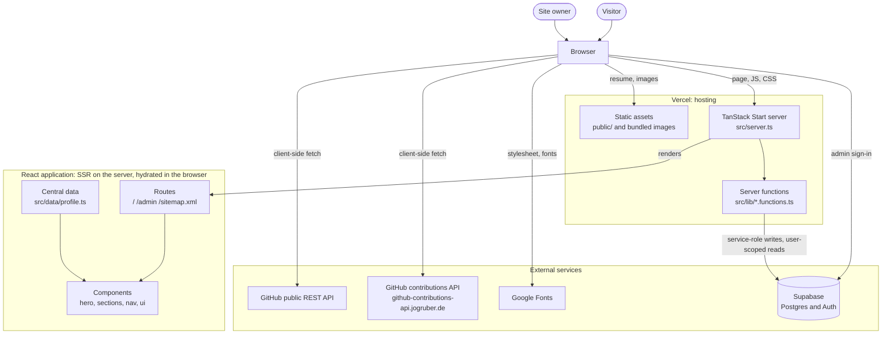
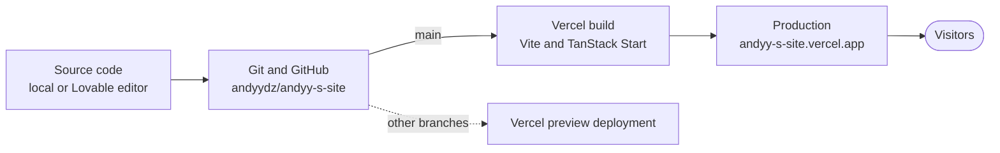
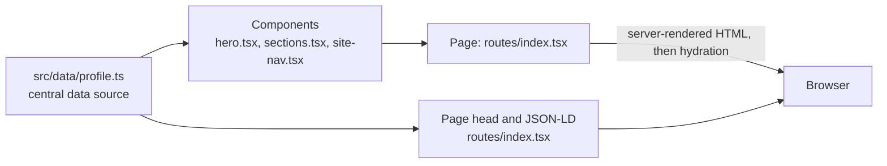
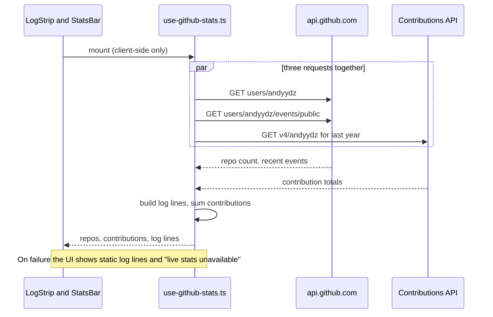
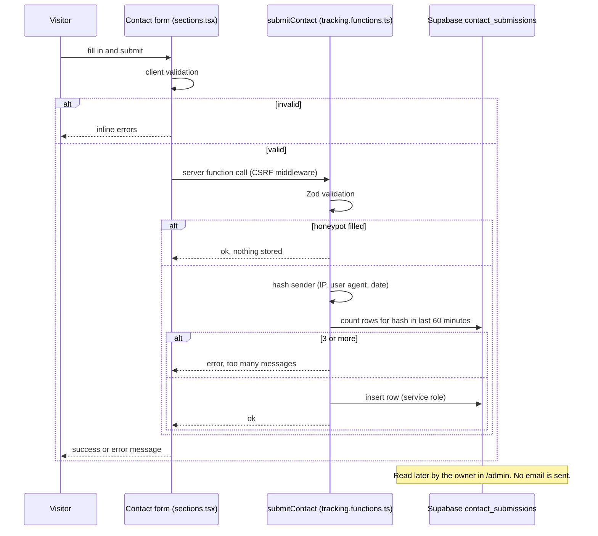
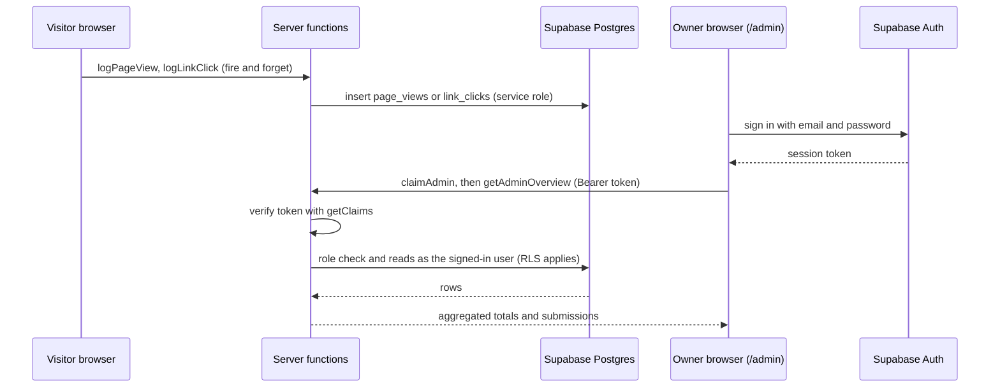

# System Architecture

> How **ANDYY-S-SITE** actually works, traced from the code on the `main` branch.
> Where something could not be verified from the repository, this document says so.

**Evidence base:** `src/`, `public/`, `supabase/`, `.lovable/`, `package.json`, `vite.config.ts`, `tsconfig.json`, `components.json`, `AGENTS.md`, `roadmap.md`, `README.md`, and the deployed site.
**Not verifiable from the repository:** Vercel project settings, Supabase dashboard settings, and any LinkedIn wording.

---

## 1. Architecture Overview

ANDYY-S-SITE is a **server-rendered React application** built on **TanStack Start**. Its public face is a single-page portfolio whose content lives in one TypeScript file. A small **server-function layer** backed by **Supabase** (Postgres and Auth) handles three operational features: the contact form, first-party analytics, and a private admin dashboard. GitHub data is fetched from the browser. The site is hosted on **Vercel**.

### 1.1 At a glance

| Aspect | What the repository shows |
|---|---|
| **Frontend framework** | React 19 with TanStack Start (SSR) and TanStack Router (file-based routing) |
| **Build tooling** | Vite 8 through `@lovable.dev/vite-tanstack-config`, which bundles the TanStack Start, React, Tailwind CSS v4, tsconfig-paths and Nitro plugins |
| **Application entry** | There is no hand-written `main.tsx` or `index.html`. Entry is defined by `src/server.ts` (server entry), `src/start.ts` (Start instance and middleware), `src/router.tsx` (router factory) and `src/routes/__root.tsx` (HTML shell). TanStack Start generates the client entry. |
| **Routing** | Three routes: `/`, `/admin`, `/sitemap.xml` |
| **Component architecture** | Section components composed by one page route, plus a generated shadcn/ui primitive set |
| **Data sources** | Central static file `src/data/profile.ts`; live GitHub data; Supabase tables |
| **API integrations** | GitHub REST API and a third-party GitHub contributions API (both from the browser); Supabase (from server functions and, for sign-in only, the browser) |
| **Backend / server code** | TanStack Start server functions in `src/lib/*.functions.ts`, one server route (`sitemap.xml`), request and function middleware, and a custom server entry that adds security headers |
| **Database** | Supabase Postgres, four tables, actively used (see [Section 9](#9-supabase-architecture)) |
| **Static assets** | `public/` (served verbatim) and `src/assets/` (bundled and hashed) |
| **Deployment platform** | Vercel |

### 1.2 Component classification

| Category | Members |
|---|---|
| **Frontend / runtime (browser)** | React components, hooks, client-side GitHub fetching, client-side form validation, Supabase browser client (admin sign-in and token attachment) |
| **Server / runtime (host)** | SSR of routes, server functions (`logPageView`, `logLinkClick`, `submitContact`, `claimAdmin`, `isAdmin`, `getAdminOverview`), `/sitemap.xml` handler, security-header wrapper |
| **External services** | Supabase, GitHub API, GitHub contributions API, Google Fonts |
| **Development tooling** | Vite, TypeScript, ESLint, Prettier, Tailwind CSS, shadcn CLI configuration, Lovable editor and config package |
| **Deployment infrastructure** | GitHub (source), Vercel (build, hosting, HTTPS) |

---

## 2. High-Level Architecture Diagram



---

## 3. Frontend Architecture

### 3.1 Directory map

```text
src/
├── server.ts                  Custom server entry (error normalization, security headers)
├── start.ts                   TanStack Start instance: middleware registration
├── router.tsx                 Router factory (QueryClient context, scroll restoration)
├── routeTree.gen.ts           Generated route tree (do not edit)
├── styles.css                 Tailwind v4 tokens, effects, print rules
├── vite-env.d.ts              Declares the build-time __BUILD_DATE__ constant
├── routes/
│   ├── __root.tsx             HTML shell, global head, 404 and error components
│   ├── index.tsx              Public portfolio page ("/")
│   ├── admin.tsx              Private dashboard ("/admin", client-rendered)
│   ├── sitemap[.]xml.ts       Server route ("/sitemap.xml")
│   └── README.md              Routing conventions note
├── components/
│   ├── site-nav.tsx           Fixed header and mobile menu
│   ├── hero.tsx               Hero section
│   ├── sections.tsx           LogStrip, StatsBar, About, Skills, Projects,
│   │                          Certifications, Experience, Volunteering,
│   │                          Testimonial, Contact, SiteFooter
│   ├── intro-sequence.tsx     First-visit boot intro
│   ├── matrix-rain.tsx        Canvas background effect
│   ├── qr-code.tsx            Footer QR code
│   ├── motion-debug.tsx       Dev/QA motion audit overlay
│   └── ui/                    46 generated shadcn/ui primitives
├── data/
│   └── profile.ts             Central portfolio content
├── hooks/
│   ├── use-github-stats.ts    GitHub data fetching
│   ├── use-reveal.ts          Scroll-reveal and reduced-motion hooks
│   └── use-mobile.tsx         Viewport helper hook
├── lib/
│   ├── tracking.functions.ts  logPageView, logLinkClick, submitContact
│   ├── admin.functions.ts     claimAdmin, isAdmin, getAdminOverview
│   ├── track.ts               Fire-and-forget client wrappers for tracking
│   ├── error-capture.ts       Error capture helper for the server entry
│   ├── error-page.ts          Static HTML for 500 responses
│   ├── lovable-error-reporting.ts  Editor error-reporting hook (no-op outside Lovable)
│   └── utils.ts               Shared class-name helper
├── integrations/supabase/     Generated Supabase integration (see Section 9)
└── assets/
    ├── headshot.jpg
    └── skull.png
```

The repository has **no `src/servers/` directory**. Server-side code lives in `src/lib/*.functions.ts`, `src/server.ts`, `src/start.ts`, and the server route in `src/routes/`.

### 3.2 How the pieces relate

| Layer | Files | Role |
|---|---|---|
| **Entry and shell** | `server.ts`, `start.ts`, `router.tsx`, `routes/__root.tsx` | `server.ts` wraps TanStack Start's default server entry. `start.ts` registers middleware. `router.tsx` builds the router with a React Query client in context and scroll restoration on. `__root.tsx` renders the `<html>` document, global head tags (fonts, favicon, referrer policy), the `QueryClientProvider`, and the 404 and error screens. |
| **Pages** | `routes/index.tsx`, `routes/admin.tsx` | `index.tsx` sets page metadata and JSON-LD, then composes the portfolio from section components. `admin.tsx` is a self-contained client-rendered dashboard. |
| **Components** | `components/*.tsx` | Presentation. Section components read from `profile` and call hooks. |
| **Data** | `data/profile.ts` | Single source of portfolio content. |
| **Hooks** | `hooks/*.ts` | `use-github-stats` (data), `use-reveal` (scroll reveal and `usePrefersReducedMotion`). |
| **Server logic** | `lib/*.functions.ts` | Server functions callable from the browser. They load the service-role Supabase client with a dynamic import so it stays out of the client bundle. |
| **Integrations** | `integrations/supabase/*` | Supabase clients, auth middleware and generated types. |
| **Styling** | `styles.css`, Tailwind classes | Design tokens (`oklch` colors), scanline and reveal utilities, reduced-motion and print rules. `components.json` configures shadcn/ui (new-york style, Lucide icons). |
| **Assets** | `assets/` | Imported by components, so Vite hashes the filenames. |

### 3.3 Page composition

`routes/index.tsx` renders this tree:

```text
Index
├── scanlines overlay (decorative)
├── IntroSequence            (first visit only, skipped for reduced motion)
├── SiteNav
├── <main>
│   ├── Hero (includes MatrixRain)
│   ├── LogStrip             (uses useGitHubStats)
│   ├── StatsBar             (uses useGitHubStats)
│   ├── About
│   ├── Skills
│   ├── Projects
│   ├── Certifications
│   ├── Experience
│   ├── Volunteering
│   ├── Testimonial
│   └── Contact              (uses submitContact server function)
├── SiteFooter               (includes SiteQrCode)
└── MotionDebug              (hidden unless Ctrl+Shift+D or ?debug=motion)
```

Only `Button` from `components/ui/` was seen in the page components. The rest of the `ui/` folder is a generated kit, and this document does not claim each primitive is used.

---

## 4. Routing Architecture

**Library:** TanStack Router, file-based, with the route tree generated into `src/routeTree.gen.ts`.

| Route | File | Rendering | Purpose |
|---|---|---|---|
| `/` | `routes/index.tsx` | SSR, then hydrated | The entire public portfolio |
| `/admin` | `routes/admin.tsx` | `ssr: false` (client only) | Private dashboard; `noindex, nofollow` |
| `/sitemap.xml` | `routes/sitemap[.]xml.ts` | Server route (`GET` handler) | Returns a one-URL XML sitemap with a one-hour cache header |

**Navigation flow.** The portfolio is a **single page with section navigation**, not a multi-page app. `SiteNav` links to in-page anchors (`#about`, `#skills`, `#projects`, `#certifications`, `#experience`, `#contact`). An `IntersectionObserver` marks the active section. `#volunteering` and `#testimonial` exist as sections but are not in the header. The router's `Link` component is used only on the 404 page.

**404 handling.** `notFoundComponent` on the root route renders a terminal-styled "SEGMENT NOT FOUND" page with a link home. There are no redirects and no other fallback routes.

**Error handling.** Rendering errors hit `errorComponent` in `__root.tsx`. Server errors are caught by `errorMiddleware` in `start.ts` and by the wrapper in `server.ts`, and return a static HTML 500 page from `lib/error-page.ts`.

---

## 5. Data Architecture

### 5.1 Where each kind of data comes from

| Data | Nature | Source | Consumed by |
|---|---|---|---|
| Identity (name, alias, title, subtitle, email, links) | Static, manually maintained | `profile` in `data/profile.ts` | Hero, Contact, footer, JSON-LD in `index.tsx`, and the owner-email check in `admin.functions.ts` |
| About text | Static, manual | `profile.about` | `About` |
| Skills | Static, manual | `profile.skillGroups` (three groups) | `Skills` |
| Featured projects | Static, manual | `profile.featuredProjects` (problem / approach / outcome / next) | `Projects` |
| Other projects | Static, manual | `profile.projects` (description and tags) | `Projects` |
| Certifications | Static, manual | `profile.certifications`, `profile.certsInProgress` | `Certifications` |
| Experience, volunteering | Static, manual | `profile.experience`, `profile.volunteering` | `Experience`, `Volunteering` (via `TimelineList`) |
| Recommendation | Static, manual | `profile.testimonial` | `Testimonial` |
| TryHackMe statistics | **Manual** | `profile.stats`, `profile.notableRooms` | `StatsBar` |
| GitHub repo count, contributions, activity | **Dynamic**, from an external API | `hooks/use-github-stats.ts` | `LogStrip`, `StatsBar` |
| Fallback activity lines | Static, manual | `profile.logLines` | `LogStrip` |
| Contact submissions, page views, link clicks | **Stored in Supabase** | `lib/tracking.functions.ts` writes, `lib/admin.functions.ts` reads | Written by visitors' actions; read only in `/admin` |
| Resume | Static file | `public/resume.pdf` | Header and hero links |

### 5.2 How components consume `profile.ts`

Components import the object directly with `import { profile } from "@/data/profile"`. There is no context provider, store, or CMS. The data ships in the JavaScript bundle and in the server-rendered HTML. `export type Profile = typeof profile` derives its type from the data itself.

### 5.3 Data that is not centralized

| Value | Where it actually lives |
|---|---|
| Production URL | Hard-coded in both `routes/index.tsx` (`SITE_URL`) and `routes/sitemap[.]xml.ts` (`BASE_URL`) |
| GitHub username for API calls | Hard-coded as `HANDLE` in `hooks/use-github-stats.ts`, alongside `profile.handle` |
| Section list for the header | `SECTIONS` in `components/site-nav.tsx` |
| Featured project | `profile.featuredProject` (singular) duplicates the first entry of `featuredProjects`. `Projects` renders `featuredProjects`. |
| TryHackMe figures in prose | Also written into `profile.about`, `profile.subtitle` and `profile.logLines`, separately from `profile.stats` |

---

## 6. GitHub API Architecture

Implemented in `src/hooks/use-github-stats.ts` and displayed by `LogStrip` and `StatsBar` in `components/sections.tsx`.

| Question | Answer (from code) |
|---|---|
| **Client or server?** | Client-side only. The fetch runs in a `useEffect`, so the server-rendered HTML contains only the loading state. |
| **Authentication** | None. No token or header is sent. |
| **Endpoints** | `https://api.github.com/users/andyydz`, `https://api.github.com/users/andyydz/events/public?per_page=30`, and `https://github-contributions-api.jogruber.de/v4/andyydz?y=last` (a third-party service, not GitHub) |
| **Data used** | `public_repos` from the user record. Push and repository-creation events from the events feed. A summed `total` of contributions over the last year from the third-party API. |
| **Processing** | The three requests start together with `Promise.all`. The first three push/create events become log lines such as `[LOG] Pushed 3 commits to SOC-Portfolio` or `[LOG] Created repository X`. Contribution totals are summed across the `total` values returned. |
| **UI** | `LogStrip` merges live lines with `profile.logLines`, removes duplicates, and shows three (all when expanded). `StatsBar` shows "public repos" and "contributions (last year)". |
| **Failure handling** | If the user request fails, the hook sets `error`, `StatsBar` shows "live stats unavailable", and `LogStrip` uses the static lines. A failed events request gives an empty list. A failed contributions request shows "—". A `cancelled` flag prevents state updates after unmount. |
| **Allow-listing** | `connect-src` in the Content Security Policy (`server.ts`) permits `api.github.com` and the contributions host. |

`useGitHubStats()` is called separately by `LogStrip` and `StatsBar`. Each instance makes its own set of requests, with no shared cache.

---

## 7. TryHackMe Data Architecture

**Mechanism: manual local data.** Nothing in the code fetches from TryHackMe.

- `profile.stats` holds four entries (rank, badges, streak, rooms). The source comment reads "Manual — TryHackMe has no stable public API."
- `StatsBar` renders them as `TRYHACKME / <label>` cards. `useCountUp` animates each number once when the section scrolls into view, and skips the animation for reduced motion.
- `profile.notableRooms` is joined into a single line under the cards.
- `profile.links.tryhackme` is a link to the public profile.
- The CSP `connect-src` does not allow `tryhackme.com`, so a browser-side fetch would be blocked in production.
- The stats section carries the accessible label "Verified learning statistics"; the figures are values typed into `profile.ts`, not values verified by code.

---

## 8. Contact Form Architecture

**Verified flow:**

1. **Form component.** `Contact` in `components/sections.tsx`: fields `name`, `email`, `message`, plus a hidden `company_url` honeypot (`tabIndex={-1}`, `autoComplete="off"`, hidden from assistive technology).
2. **Client validation.** Name 2–80 characters, email matches a simple pattern and is at most 254 characters, message 10–1000 characters. Errors render in an `aria-live` list. No request is sent if any check fails.
3. **Submission.** `useServerFn(submitContact)` calls a TanStack Start server function. The global function middleware `attachSupabaseAuth` runs first (it attaches a bearer token only if a session exists), and `csrfMiddleware` protects the call.
4. **Server validation.** `submitContact` in `lib/tracking.functions.ts` parses the input with a Zod schema (the same limits, with `trim` applied).
5. **Honeypot.** If `company_url` is filled, the function returns success without storing anything.
6. **Rate limit.** The server derives a one-way `sender_hash` (SHA-256 over IP, user agent and the current date, truncated). It counts that hash's rows in `contact_submissions` from the last 60 minutes. Three or more raises "Too many messages sent from this connection."
7. **Storage.** The service-role client inserts `name`, `email`, `message`, `sender_hash` and `emailed: false` into `contact_submissions`. The IP address is not stored.
8. **Response.** Success returns `{ ok: true }`. A failed insert throws a generic "Could not deliver your message" error.
9. **UI feedback.** On success the form resets, `trackClick("contact-form-submit")` runs, and the success line displays. On failure the error message is shown next to the form.

**What does not exist:** there is no email or notification service. The `emailed` column is written as `false` and never updated anywhere in the code. The only reader of submissions is the admin dashboard. The success text currently reads "opening your mail client…", which does not match the behavior (no mail client is opened).

See the contact sequence diagram in [Section 16.3](#163-contact-flow).

---

## 9. Supabase Architecture

**Supabase is actively used at runtime.** It is not a leftover directory.

### 9.1 What it is used for

| Purpose | Used? | Detail |
|---|---|---|
| Database storage | **Yes** | `page_views`, `link_clicks`, `contact_submissions`, `user_roles` |
| Contact form processing | **Yes (storage only)** | Inserts into `contact_submissions` |
| Analytics | **Yes** | Inserts into `page_views` and `link_clicks` |
| Authentication | **Yes, admin only** | Email and password sign-in or owner sign-up through `supabase-js` in `routes/admin.tsx` |
| Authorization | **Yes** | JWT check in `requireSupabaseAuth`, role lookup in `user_roles`, row-level security policies |
| Admin dashboard | **Yes** | `getAdminOverview` reads all three data tables |
| Migrations | **Yes** | Three SQL files in `supabase/migrations/` |
| Edge functions, storage buckets, realtime, email | **Not found** | `supabase/` contains only `migrations/` and `config.toml`, and no code path traced uses them |
| `cron-auth.ts` | **Unused** | Generated helper (`authenticateCronRequest`) with no importer |

`supabase/config.toml` contains only a `project_id`. Error messages in the integration code say "Connect Supabase in Lovable Cloud", which suggests the project was provisioned through Lovable Cloud; the repository cannot confirm where the Supabase project is managed.

### 9.2 Integration files (`src/integrations/supabase/`)

All are marked "automatically generated".

| File | Role |
|---|---|
| `client.ts` | Browser client using the publishable key. Persists the session. Used by `admin.tsx` and by `auth-attacher.ts`. |
| `client.server.ts` | Server-only client using the service-role key, which bypasses row-level security. Used only inside server function handlers via dynamic `import()`. |
| `auth-middleware.ts` | `requireSupabaseAuth`: reads the `Authorization: Bearer` header, verifies it with `getClaims`, and builds a per-request client that runs as that user. |
| `auth-attacher.ts` | Global client-side function middleware that adds the bearer token (if a session exists) to every server-function call. |
| `previewAuthStorage.ts` | Chooses the browser session storage: `localStorage`, or postMessage brokering when embedded in the Lovable editor preview. |
| `types.ts` | Generated TypeScript types for the database. |
| `cron-auth.ts` | Not referenced anywhere. |

### 9.3 Database schema (from `supabase/migrations/`)

| Table | Columns | Notes |
|---|---|---|
| `user_roles` | `id`, `user_id` → `auth.users(id)` (cascade delete), `role` (`app_role` enum, only `'admin'`), `created_at` | Unique on (`user_id`, `role`). Users can read their own rows. |
| `page_views` | `id`, `path`, `referrer_host`, `visitor_hash`, `created_at` | Indexed on `created_at` |
| `link_clicks` | `id`, `label`, `created_at` | Indexed on `created_at` |
| `contact_submissions` | `id`, `name`, `email`, `message`, `sender_hash`, `emailed`, `created_at` | Indexed on `created_at` |

**Security model.** Row-level security is enabled on all four tables. `SELECT` is granted to `authenticated` and restricted by policy to admins (through `private.has_role`), except `user_roles`, which lets a user read their own rows. `service_role` has full access. There are **no insert policies for browser roles**, so all writes go through server functions using the service-role client.

**Migration history.** (1) Creates the enum, tables, `has_role`, RLS and policies. (2) Revokes execute on `has_role` from `PUBLIC` and `anon`. (3) Moves `has_role` into a `private` schema and rewrites the policies to use it.

### 9.4 Environment variables (names only)

| Variable | Used by |
|---|---|
| `SUPABASE_URL`, `VITE_SUPABASE_URL` | Server and browser clients, and the CSP allow-list |
| `SUPABASE_PUBLISHABLE_KEY`, `VITE_SUPABASE_PUBLISHABLE_KEY` | Browser client and the auth middleware |
| `SUPABASE_SERVICE_ROLE_KEY` | Server-only admin client |
| `LOVABLE_CRON_SECRET`, `LOVABLE_CRON_SECRET_PREVIOUS` | Only the unused `cron-auth.ts` |

`.env` is git-ignored and no environment file is committed.

---

## 10. Admin and Analytics Architecture

**Both exist and are implemented.**

### 10.1 Analytics (first-party)

| Event | Trigger | Server function | Storage |
|---|---|---|---|
| Page view | `Index` effect on mount → `trackPageView` | `logPageView` | `page_views` (path, referrer host, visitor hash) |
| Link click | Click handlers in the hero, footer and contact form → `trackClick` | `logLinkClick` | `link_clicks` (label) |

Page views are throttled to 30 per visitor hash per hour. Page-view logging runs only from the home route. All client calls are fire-and-forget with errors swallowed, so analytics can never break the page. No third-party analytics service is used on `main`.

### 10.2 Admin dashboard

- **Route:** `/admin`, client-rendered, `noindex, nofollow`, disallowed in `robots.txt`, and not linked from the site.
- **Sign-in:** a login card offers email and password sign-in, plus a "create the owner account" mode, using Supabase Auth from the browser.
- **Server-side gate:** every dashboard request goes through `requireSupabaseAuth`. `claimAdmin` grants the admin role only if the token's email matches the owner email in `profile.ts` **and** no admin exists yet. `getAdminOverview` then re-checks the role.
- **Data access:** `getAdminOverview` reads with the **user-scoped** client, so row-level security applies on top of the code check.
- **Contents:** totals (90, 30 and 7 days), visits by day and by week, top referrers, most-clicked links, and the latest 100 contact submissions. Aggregation happens in memory inside the server function.
- **Limits:** the queries read at most 5,000 page views and 5,000 clicks from the last 90 days.

See the analytics and admin diagrams in [Section 16.4](#164-analytics-and-admin-flow).

---

## 11. Static Asset Architecture

### 11.1 Files in `public/`

| File | Role |
|---|---|
| `resume.pdf` | Downloadable resume, linked from the header and hero |
| `favicon.png` | Site icon, declared in `__root.tsx` |
| `og-image.jpg` | Social preview image, referenced by absolute URL in metadata and JSON-LD |
| `robots.txt` | Allows crawling, disallows `/admin`, points to the sitemap |
| `security.txt` | Security contact file |
| `.well-known/security.txt` | Standard-location `security.txt` |

### 11.2 Bundled assets and dynamic resources

- `src/assets/headshot.jpg` and `src/assets/skull.png` are imported by components, so Vite fingerprints them (for example `/assets/headshot-<hash>.jpg` on the live site).
- `/sitemap.xml` is not a file. It is a server route.
- Files in `public/` are copied as-is and served from the site root by the host.
- Fonts are not bundled. They come from Google Fonts (`__root.tsx`).

---

## 12. SEO Architecture

Only the relationships are shown here. Details belong in `docs/09-seo.md`.

| Resource | Defined in |
|---|---|
| Default title, description, author, `og:site_name`, `twitter:card`, referrer meta | `routes/__root.tsx` |
| Page title, description, `robots: index, follow`, Open Graph and Twitter tags, canonical link | `routes/index.tsx` (overrides the root values for `/`) |
| JSON-LD `Person` | `routes/index.tsx`, built from `profile` |
| Search Console verification tag | `routes/index.tsx` |
| Social preview image | `public/og-image.jpg`, referenced from the metadata |
| `robots.txt` | `public/robots.txt` |
| Sitemap | `routes/sitemap[.]xml.ts` |
| Exclusion of `/admin` | `noindex, nofollow` meta in `admin.tsx` and `Disallow` in `robots.txt` |

---

## 13. Security Architecture

High-level controls only. The full assessment belongs in `docs/13-security.md`.

### 13.1 Response headers

`src/server.ts` wraps every response from the server entry with these headers:

| Header | Value |
|---|---|
| `Content-Security-Policy` | `default-src 'self'`; scripts `'self' 'unsafe-inline'`; styles `'self' 'unsafe-inline'` plus Google Fonts; fonts from Google Fonts and `data:`; images `'self' data: blob: https:`; `connect-src` `'self'`, GitHub API, the contributions API and the Supabase origin; `base-uri 'self'`; `form-action 'self'` |
| `Strict-Transport-Security` | `max-age=31536000; includeSubDomains` |
| `X-Frame-Options` | `DENY` |
| `X-Content-Type-Options` | `nosniff` |
| `Referrer-Policy` | `strict-origin-when-cross-origin` (also set as a meta tag) |
| `Permissions-Policy` | camera, microphone and geolocation disabled |

### 13.2 Other controls

| Area | Mechanism |
|---|---|
| **HTTPS** | Provided by the host. The app also sends HSTS. |
| **Input validation** | Browser checks, then Zod schemas on the server (`tracking.functions.ts`) |
| **Spam protection** | Honeypot field and per-hash rate limits (3 messages and 30 page views per hour) |
| **CSRF** | `createCsrfMiddleware` on server functions in `start.ts` |
| **Authentication** | Supabase Auth JWT, verified server-side with `getClaims` |
| **Authorization** | Role check in code, plus row-level security through `private.has_role` |
| **Secrets** | Service-role key read from `process.env`, used only in `client.server.ts`, imported dynamically inside handlers |
| **Public / private boundary** | Public: the portfolio, resume, sitemap, robots, `security.txt`. Private: all three data tables, readable only by an admin. |
| **Visitor identifiers** | One-way hash of IP, user agent and date. IP addresses are not stored. |
| **API exposure** | Server functions are the only application API. There are no hand-written REST endpoints other than `/sitemap.xml`. |

---

## 14. Build and Deployment Flow



### 14.1 Verified commands

Defined in `package.json`:

| Command | Runs | Purpose |
|---|---|---|
| `npm run dev` | `vite dev` | Development server |
| `npm run build` | `vite build` | Production build |
| `npm run build:dev` | `vite build --mode development` | Development-mode build |
| `npm run preview` | `vite preview` | Preview a build |
| `npm run lint` | `eslint .` | Lint |
| `npm run format` | `prettier --write .` | Format |

There is **no `test` script** and **no `start` script**.

### 14.2 Build details

- `vite.config.ts` uses `@lovable.dev/vite-tanstack-config`. Its comment notes that it includes Nitro for builds, with Cloudflare as the default target, and it redirects the server entry to `src/server.ts`.
- The config defines `__BUILD_DATE__` at build time. The footer uses it for the copyright year.
- Both `package-lock.json` and `bun.lock` are committed. `bunfig.toml` adds a 24-hour minimum release age for installed packages.
- `.gitignore` excludes `dist`, `.output`, `.nitro`, `.env` and Wrangler files.

### 14.3 Deployment

- The site is deployed on **Vercel**, and the GitHub repository shows Production and Preview deployment records.
- The repository contains no `vercel.json` and no `.github/` directory, so there are **no GitHub Actions workflows** and no CI/CD pipeline defined in code.
- Two `vercel/…` branches (Speed Insights and Web Analytics installs) exist on the remote and are **not merged into `main`**.
- Vercel's build command, output, framework preset and environment variables are configured outside the repository, so they could not be verified.
- The repository stays connected to Lovable, and `AGENTS.md` asks that published Git history not be rewritten.

---

## 15. External Services

| Service | Role | Integration | Runtime Dependency |
|---|---|---|---|
| **Vercel** | Hosting, HTTPS, build and deployment | Git-connected; settings outside the repo | **Yes** |
| **Supabase** | Postgres, Auth, RLS | `supabase-js` from server functions and the admin page | **Yes** for contact form, analytics and admin. The portfolio content itself renders without it. |
| **GitHub** | Source hosting and public activity data | Browser `fetch` to `api.github.com` | **Optional.** Static fallbacks exist. |
| **GitHub contributions API** (`github-contributions-api.jogruber.de`) | Last-year contribution total | Browser `fetch` | **Optional.** Shows "—" on failure. |
| **Google Fonts** | JetBrains Mono and Inter | Stylesheet link in `__root.tsx` | **Optional.** System font fallbacks exist. |
| **Lovable** | Original authoring environment, editor sync | Dev dependency `@lovable.dev/vite-tanstack-config`, `.lovable/`, no-op error hooks | **Build-time only** |
| **TryHackMe** | Learning platform | Link only, plus manually entered stats | **No** |
| **LinkedIn**, **Reddit** | Professional and social profiles | Links only | **No** |
| **Google Search Console** | Ownership verification | Meta tag | **No** |
| **Email / contact service** | — | None exists | **No** |
| **Third-party analytics** | — | None on `main`. Analytics is first-party through Supabase. | **No** |

---

## 16. Architectural Data Flow

### 16.1 Portfolio content flow



### 16.2 Dynamic GitHub data flow



### 16.3 Contact flow



### 16.4 Analytics and admin flow



---

## 17. Architectural Decisions

Each entry describes the observable technical role, not a historical reason.

| Decision | Technical role |
|---|---|
| **Component-based React frontend** | Each portfolio section is its own component composed by one route, so sections can change independently. |
| **SSR with TanStack Start** | The public page is delivered as rendered HTML (the live page shows loading states such as `fetching activity…` in the initial HTML), then hydrated. |
| **Centralized portfolio data** | `profile.ts` holds all content and links, so updates touch data, not layout. |
| **Client-side GitHub integration** | Live activity comes straight from public endpoints with no server involvement and no secrets. |
| **Manual TryHackMe data** | No API is used, so the values are edited in `profile.ts`. |
| **Server functions for writes** | The browser never holds database write credentials. Only server handlers use the service-role key. |
| **Supabase as the backend** | Provides storage, auth and row-level security without a custom server or database. |
| **Defense in depth on admin access** | Bearer-token verification, an in-code role check, and database RLS all apply. |
| **Custom server entry** | `server.ts` centralizes security headers and turns swallowed SSR failures into a proper 500 page. |
| **Public static assets** | Resume, icons, `robots.txt` and `security.txt` are plain files served from the site root. |
| **Vercel hosting** | Provides hosting, HTTPS, and Git-driven production and preview deployments. |

---

## 18. Architectural Limitations

Only limitations visible in the repository are listed.

| Limitation | Evidence |
|---|---|
| **GitHub data depends on unauthenticated public APIs.** | No token is used. Each page load makes four requests to `api.github.com` and two to the contributions API (two hook instances), with no shared cache. GitHub applies rate limits to unauthenticated calls. |
| **A third-party service supplies the contribution count.** | `github-contributions-api.jogruber.de` is outside the project's control. |
| **TryHackMe figures go stale.** | They are hand-edited, and the same numbers are repeated in prose in `profile.ts`. |
| **Contact messages have no notification path.** | `emailed` is never set, and messages are visible only after signing in to `/admin`. The success message wording does not match the behavior. |
| **Server functions require the Supabase client to be configured in the browser bundle.** | The global `attachSupabaseAuth` middleware creates the client on every server-function call, so a missing configuration would break analytics and the contact form. |
| **Admin metrics are capped.** | Queries read at most 5,000 rows each, and aggregation is in memory. |
| **The sign-up UI is reachable at `/admin`.** | Authorization is enforced server-side and by RLS, and Supabase auth settings such as signup policy live outside the repo and were not verified. |
| **CSP permits inline scripts and styles.** | `'unsafe-inline'` appears in `script-src` and `style-src`. |
| **Security headers come from the app's server entry.** | Whether static files in `public/` also receive them depends on the host and was not verified. |
| **No automated tests and no CI.** | There is no `test` script and no `.github/` workflows. |
| **Deployment configuration is outside the repository.** | Vercel settings are not versioned. The build config's default Nitro target is Cloudflare, and no override for Vercel is present in the repository. |
| **Duplicated constants and stale defaults.** | Production URL in two files, GitHub handle in the hook, and the QR component's fallback URL is an old `lovable.app` address (replaced by the real origin once the page loads). |
| **Unused code.** | `integrations/supabase/cron-auth.ts` has no importer, and `profile.featuredProject` duplicates `featuredProjects[0]`. |
| **Two lockfiles.** | `package-lock.json` and `bun.lock` can drift apart. |
| **Single-page structure.** | Only three routes exist. Projects and writeups link to external repositories and have no pages of their own. |

---

## 19. System Architecture Summary

A visitor's browser requests the site from Vercel, where TanStack Start renders the React page on the server and returns HTML, JavaScript and CSS. The page reads all its portfolio content from `src/data/profile.ts`, so the content pipeline needs no backend. After hydration the browser fetches recent activity and repo counts directly from GitHub, along with a contribution total from a third-party service, and falls back to static text if either fails.

Three features go through server functions. Page-view and click logging and the contact form write to Supabase using a server-only service-role key. After validation, honeypot and rate-limit checks, nothing is emailed, and messages sit in a table. The owner signs in at `/admin` through Supabase Auth, and server functions verify the token, check the admin role, and read the aggregated data under row-level security.

Static files (resume, icons, `robots.txt`, `security.txt`) are served from the site root. A custom server entry adds security headers to responses. Source lives on GitHub and Vercel builds and deploys it, with no CI defined in the repository.
