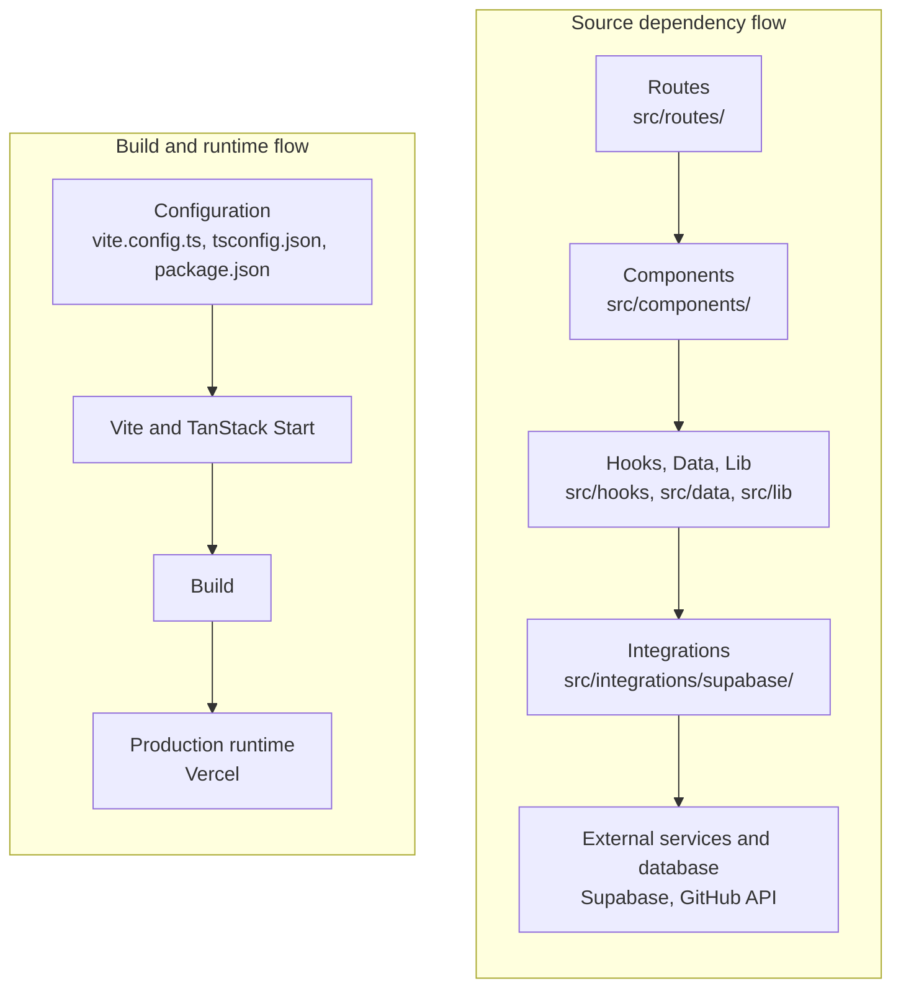

# Project Structure

> Layout of the **Andyy DZ Cybersecurity Portfolio** repository (`andyydz/andyy-s-site`): what each directory and file is for, and how the pieces relate.

---

## 1. Project Structure Overview

The project is a **TypeScript** application built with **React** and **TanStack Start**. The repository separates its concerns into distinct areas:

| Area | Purpose |
|---|---|
| Application routes | Page and endpoint definitions |
| Reusable UI components | Portfolio sections and UI primitives |
| Static portfolio data | Central content file |
| Custom React hooks | Reusable client-side behavior |
| Libraries and utilities | Tracking, server functions, error helpers |
| Third-party integrations | Supabase clients and middleware |
| Assets | Build-managed images |
| Public resources | Files served directly by URL |
| Supabase configuration | Project config and database migrations |
| Documentation | Numbered technical documents |
| Build and configuration files | Vite, TypeScript, lint, format, package management |

General organization:

```text
project root
├── src/                    application source
├── public/                 directly served files
├── supabase/               backend configuration and migrations
├── docs/                   technical documentation
├── configuration files     Vite, TypeScript, ESLint, Prettier, shadcn/ui
└── package / dependency files
```

---

## 2. Complete Project Tree

```text
/
├── src/
│   ├── assets/
│   │   ├── headshot.jpg
│   │   └── skull.png
│   ├── components/
│   │   ├── hero.tsx
│   │   ├── intro-sequence.tsx
│   │   ├── matrix-rain.tsx
│   │   ├── motion-debug.tsx
│   │   ├── qr-code.tsx
│   │   ├── sections.tsx
│   │   ├── site-nav.tsx
│   │   └── ui/                      46 generated UI primitives
│   ├── data/
│   │   └── profile.ts
│   ├── hooks/
│   │   ├── use-github-stats.ts
│   │   ├── use-mobile.tsx
│   │   └── use-reveal.ts
│   ├── integrations/
│   │   └── supabase/
│   │       ├── auth-attacher.ts
│   │       ├── auth-middleware.ts
│   │       ├── client.server.ts
│   │       ├── client.ts
│   │       ├── cron-auth.ts
│   │       ├── previewAuthStorage.ts
│   │       └── types.ts
│   ├── lib/
│   │   ├── admin.functions.ts
│   │   ├── error-capture.ts
│   │   ├── error-page.ts
│   │   ├── lovable-error-reporting.ts
│   │   ├── track.ts
│   │   ├── tracking.functions.ts
│   │   └── utils.ts
│   ├── routes/
│   │   ├── README.md
│   │   ├── __root.tsx
│   │   ├── admin.tsx
│   │   ├── index.tsx
│   │   └── sitemap[.]xml.ts
│   ├── routeTree.gen.ts
│   ├── router.tsx
│   ├── server.ts
│   ├── start.ts
│   ├── styles.css
│   └── vite-env.d.ts
│
├── public/
│   ├── .well-known/
│   │   └── security.txt
│   ├── favicon.png
│   ├── og-image.jpg
│   ├── resume.pdf
│   ├── robots.txt
│   └── security.txt
│
├── supabase/
│   ├── config.toml
│   └── migrations/                  3 SQL migration files
│
├── docs/
│   ├── 01-project-overview.md
│   ├── 02-requirements.md
│   ├── 03-system-architecture.md
│   ├── 04-project-structure.md
│   ├── 05-terminologies.md
│   ├── 06-technology-stack.md
│   ├── 07-features.md
│   ├── 08-ui-design.md
│   ├── 09-seo.md
│   ├── 10-githun-workflow.md
│   ├── 11-deployment.md
│   ├── 12-testing.md
│   ├── 13-security.md
│   ├── 14-maintanance.md
│   └── 15-future-improvements.md
│
├── .lovable/
│   ├── plan/
│   │   └── professional-soc-portfolio-refinement-2026-09-08.md
│   └── project.json
│
├── .gitignore
├── .prettierignore
├── .prettierrc
├── AGENTS.md
├── LICENSE
├── README.md
├── bun.lock
├── bunfig.toml
├── components.json
├── eslint.config.js
├── package-lock.json
├── package.json
├── roadmap.md
├── tsconfig.json
└── vite.config.ts
```

The repository has additional root-level files beyond the baseline list, documented in the sections below. It contains no test directory, no `.github/` workflows and no `vercel.json`.

---

## 3. `src/` Directory

`src/` is the main application source directory. It contains the application's:

- React **components** (`components/`)
- **routes** (`routes/`)
- portfolio **data** (`data/`)
- **hooks** (`hooks/`)
- **libraries** and server functions (`lib/`)
- **integrations** (`integrations/`)
- **server implementation** (`server.ts`, `start.ts`)
- **styling** (`styles.css`)
- **generated routing information** (`routeTree.gen.ts`)
- **application configuration** (`router.tsx`, `vite-env.d.ts`)

| Item | Role |
|---|---|
| `assets/` | Build-managed images |
| `components/` | Portfolio components and UI primitives |
| `data/` | Central content |
| `hooks/` | Reusable client logic |
| `integrations/` | External-service isolation |
| `lib/` | Application logic and server functions |
| `routes/` | Route definitions |
| `router.tsx`, `routeTree.gen.ts` | Router setup and generated route tree |
| `server.ts`, `start.ts` | Server entry and middleware |
| `styles.css` | Global styling |
| `vite-env.d.ts` | Type reference for Vite and the `__BUILD_DATE__` constant |

---

## 4. `src/components/`

The reusable React component layer.

| File | Responsibility |
|---|---|
| `hero.tsx` | Main portfolio hero section: name, role, actions, profile photo. Hosts the matrix background. |
| `intro-sequence.tsx` | Initial terminal-style boot introduction, shown once per browser and skippable |
| `matrix-rain.tsx` | Matrix-style canvas background effect |
| `motion-debug.tsx` | Development and QA overlay that audits motion and reveal behavior (toggled with `Ctrl+Shift+D` or `?debug=motion`) |
| `qr-code.tsx` | `SiteQrCode`: generates and displays a QR code linking to the site |
| `sections.tsx` | Main portfolio sections: `LogStrip`, `StatsBar`, `About`, `Skills`, `Projects`, `Certifications`, `Experience`, `Volunteering`, `Testimonial`, `Contact`, `SiteFooter` |
| `site-nav.tsx` | Responsive navigation: section links, active-section state, resume link, mobile menu |
| `ui/` | Reusable UI primitives |

---

## 5. `src/components/ui/`

This directory holds **reusable interface primitives**, not page-specific portfolio sections. They are generated by shadcn/ui (`new-york` style, configured in `components.json`) on top of the **Radix UI** ecosystem.

The installed set covers common interface behavior, including:

- buttons
- dialogs and drawers
- menus and dropdowns
- forms
- navigation
- tabs
- tooltips
- progress indicators
- collapsible elements
- popovers
- alerts
- switches and sliders
- cards and other primitives

Only `Button` was seen in the public page components. This document does **not** claim that every installed primitive or Radix package is rendered on the public homepage. The architectural point is the separation between reusable primitives and portfolio-specific components.

---

## 6. `src/routes/`

The route layer, using file-based routing.

| File | Responsibility |
|---|---|
| `__root.tsx` | Global application shell: metadata, providers, error and 404 handling, scripts and stylesheet loading |
| `index.tsx` | Public portfolio homepage (`/`) |
| `admin.tsx` | Authenticated, private administration dashboard (`/admin`) |
| `sitemap[.]xml.ts` | Dynamic sitemap endpoint (`/sitemap.xml`) |
| `README.md` | Note on TanStack Start routing conventions; not a route |

Route files handle **page-level composition and routing behavior**. Reusable visual components live under `src/components/`.

---

## 7. `src/data/`

`src/data/profile.ts` exports one `profile` object with the centralized portfolio content:

| Category | Keys |
|---|---|
| Identity, alias, contact | `name`, `alias`, `handle`, `title`, `subtitle`, `email` |
| Social links | `links` (`github`, `linkedin`, `tryhackme`, `reddit`, `resume`) |
| Biography | `about` |
| Statistics | `stats`, `notableRooms`, `logLines` |
| Skills | `skillGroups` |
| Projects | `featuredProjects`, `projects` (and a duplicate `featuredProject`) |
| Certifications | `certifications`, `certsInProgress` |
| Experience and volunteering | `experience`, `volunteering` |
| Testimonial | `testimonial` |

**Principle:**

```text
Content / data  ≠  Presentation / UI
```

Components import `profile` and render it, so portfolio information is not duplicated throughout the UI.

---

## 8. `src/hooks/`

Custom React hooks encapsulate reusable stateful, client-side logic and keep components smaller.

| File | Provides |
|---|---|
| `use-github-stats.ts` | `useGitHubStats`: fetches GitHub statistics in the browser (repo count, contributions, recent activity) |
| `use-reveal.ts` | `useReveal` (scroll-reveal behavior) and `usePrefersReducedMotion` (reduced-motion preference) |
| `use-mobile.tsx` | Viewport-size helper hook |

---

## 9. `src/lib/`

The application utility and logic layer. It holds reusable logic that does not belong inside React components.

| File | Responsibility |
|---|---|
| `track.ts` | Client wrappers `trackClick` and `trackPageView` (fire-and-forget) |
| `tracking.functions.ts` | Server functions `logPageView`, `logLinkClick`, `submitContact` |
| `admin.functions.ts` | Server functions `claimAdmin`, `isAdmin`, `getAdminOverview` |
| `error-capture.ts` | Captures the original error so the server entry can recover a stack when the framework has already turned it into a generic 500 |
| `error-page.ts` | Generates the static HTML for server error responses |
| `lovable-error-reporting.ts` | Forwards errors to Lovable editor hooks when present; does nothing otherwise |
| `utils.ts` | Small shared utility (the class-name helper configured in `components.json`) |

```text
React components → reusable application logic → integrations / server functions
```

---

## 10. `src/integrations/`

This directory isolates integrations with external and backend services. The only integration present is `src/integrations/supabase/`. All of its files are marked as generated.

| File | Responsibility |
|---|---|
| `client.ts` | Browser Supabase client (publishable key) |
| `client.server.ts` | Server-only client (service-role key), used inside server function handlers |
| `auth-middleware.ts` | Server middleware that verifies the bearer token and builds a user-scoped client |
| `auth-attacher.ts` | Client middleware that attaches the auth token to server-function requests |
| `previewAuthStorage.ts` | Session storage adapter |
| `types.ts` | Generated database types |
| `cron-auth.ts` | Generated helper that no other file imports |

**Why separate?** Service-specific logic stays in one place instead of being scattered through the UI and routes, and replacing or reconfiguring the service touches one directory.

---

## 11. `src/assets/`

Source-controlled application assets that are **imported into TypeScript/React components**:

- `headshot.jpg`: profile photo used in the hero
- `skull.png`: brand mark used in the navigation and footer

| Location | Handling |
|---|---|
| `src/assets/` | Imported through the build system, so filenames are fingerprinted and the files are bundled |
| `public/` | Served directly at a fixed URL |

---

## 12. `src/styles.css`

The global styling foundation:

- global CSS and base element styles
- **Tailwind CSS** integration (v4)
- design tokens and theme variables (colors, fonts)
- terminal / CRT-inspired styling (scanlines, panels)
- reusable classes and utilities
- animation and reveal styles
- responsive behavior
- reduced-motion rules
- print styling

---

## 13. `src/router.tsx`

`getRouter()` creates and configures the **TanStack Router** instance. It builds the router from the generated `routeTree`, creates a `QueryClient` and passes it as router context, and turns on scroll restoration. It depends on `src/routeTree.gen.ts`, which describes the route structure.

---

## 14. `src/routeTree.gen.ts`

Generated routing infrastructure, produced from the route files in `src/routes/`. It lists the routes `/`, `/admin` and `/sitemap.xml`. It is **not** the place to define routes by hand, and `.prettierignore` excludes it from formatting.

```text
src/routes/ → route definitions → generated route tree → router → application
```

---

## 15. `src/server.ts`

The application's **custom server entry**, wrapping TanStack Start's default one. It:

- loads the TanStack Start server entry
- handles SSR requests
- normalizes catastrophic SSR errors
- generates server error responses (using `error-page.ts`)
- applies **security headers**

| Header | Set here |
|---|---|
| `X-Content-Type-Options` | Yes |
| `Referrer-Policy` | Yes |
| `Permissions-Policy` | Yes |
| `X-Frame-Options` | Yes |
| `Strict-Transport-Security` | Yes |
| `Content-Security-Policy` | Yes |

`vite.config.ts` points TanStack Start's server entry at this file. The security details belong in `docs/13-security.md`.

---

## 16. `src/start.ts`

Configures **TanStack Start** middleware:

| Middleware | Role |
|---|---|
| Supabase authentication attachment (`attachSupabaseAuth`) | Adds the bearer token to server-function calls |
| Server-side error middleware | Catches unhandled errors and returns the static error page |
| CSRF middleware | Applied to **server functions** only |

---

## 17. Public Directory

`public/` contains files **served directly by URL** from the site root.

| File | Purpose |
|---|---|
| `favicon.png` | Browser and site icon |
| `og-image.jpg` | Open Graph / social preview image |
| `resume.pdf` | Public resume, linked from the header and hero |
| `robots.txt` | Crawler instructions |
| `security.txt` | Security contact information |
| `.well-known/` | Standard well-known resources (contains `security.txt`) |

These stay outside `src/assets/` because they must keep fixed, predictable URLs that browsers, crawlers and other sites reference directly. Files under `src/assets/` are renamed with content hashes at build time.

---

## 18. Supabase Directory

```text
supabase/
├── config.toml
└── migrations/
```

| Item | Responsibility |
|---|---|
| `config.toml` | Supabase project configuration (contains only the project identifier) |
| `migrations/` | Database schema migrations: three SQL files that create the tables and access policies, tighten function permissions, and move the role-check function into a `private` schema |

---

## 19. Docs Directory

`docs/` holds the project's structured technical documentation, as numbered files:

| Number | Document |
|---|---|
| 01 | Project Overview |
| 02 | Requirements |
| 03 | System Architecture |
| 04 | Project Structure |
| 05 | Terminologies |
| 06 | Technology Stack |
| 07 | Features |
| 08 | UI Design |
| 09 | SEO |
| 10 | GitHub Workflow |
| 11 | Deployment |
| 12 | Testing |
| 13 | Security |
| 14 | Maintenance |
| 15 | Future Improvements |

The numbering gives a logical reading sequence: project definition, architecture, implementation, then deployment, security and future maintenance.

Filenames are preserved exactly as they exist, including the current spellings `10-githun-workflow.md` and `14-maintanance.md`. They have not been renamed.

---

## 20. `package.json`

Defines:

- **project metadata:** name `tanstack_start_ts`, `private`, `sideEffects: false`
- **ES module configuration:** `"type": "module"`
- **npm scripts**
- **runtime dependencies**
- **development dependencies**

| Script | Runs |
|---|---|
| `npm run dev` | `vite dev` |
| `npm run build` | `vite build` |
| `npm run build:dev` | `vite build --mode development` |
| `npm run preview` | `vite preview` |
| `npm run lint` | `eslint .` |
| `npm run format` | `prettier --write .` |

There is no `test` script and no `start` script.

### 20.1 Major dependencies

| Technology | Role in this project |
|---|---|
| React, React DOM | UI |
| TanStack Start | Application framework, SSR, server functions |
| TanStack Router | File-based routing |
| TanStack React Query | Provided app-wide; used by the admin dashboard |
| Supabase JS | Auth and database access |
| Tailwind CSS | Styling |
| Radix UI | Foundation for the generated UI primitives |
| Lucide React | Icons |
| Zod | Server-side input validation |
| `qrcode` | Footer QR code |
| Vite, TypeScript, Nitro | Build, language, server build integration |
| ESLint, Prettier | Linting and formatting |

**React Hook Form** is installed to support the generated `ui/form.tsx` primitive. The public contact form does not use it: it uses `FormData` and its own checks. Other packages that support the generated UI kit (for example charts, carousel, calendar, command and drawer libraries) were not traced to any active feature and are not described as such.

Two lockfiles are committed: `package-lock.json` and `bun.lock`. `bunfig.toml` adds a 24-hour minimum release age for installed packages.

---

## 21. `vite.config.ts`

Builds on **`@lovable.dev/vite-tanstack-config`**, which supplies most of the Vite and TanStack Start integration (the TanStack Start, React, Tailwind and tsconfig-paths plugins, Nitro for builds, and the `@` path alias).

Custom configuration:

- **TanStack Start server entry** redirected to `src/server.ts`
- **`__BUILD_DATE__`** injected through Vite's `define` (used by the footer for the copyright year)

---

## 22. `tsconfig.json`

Strict TypeScript settings:

| Setting | Value |
|---|---|
| Target | `ES2022` |
| JSX | `react-jsx` (React JSX transform) |
| Module | `ESNext` |
| Module resolution | `Bundler` |
| Strictness | `strict`, plus `noUncheckedIndexedAccess`, `exactOptionalPropertyTypes`, `noImplicitReturns` and others |
| Emit | `noEmit` (Vite builds the output) |
| Includes | `src/**/*.ts`, `src/**/*.tsx`, `vite.config.ts`, `eslint.config.js` |
| Path alias | `@/*` → `./src/*` |

The alias gives clean imports such as `@/data/profile` instead of long relative paths.

---

## 23. Project Dependency Flow



The hooks in `src/hooks/` also call external APIs directly: `use-github-stats.ts` fetches from GitHub in the browser without going through `integrations/`.

---

## 24. File Responsibility Table

| Location | Responsibility |
|---|---|
| `src/routes/` | Route/page definitions |
| `src/components/` | Portfolio-specific React components |
| `src/components/ui/` | Reusable UI primitives |
| `src/data/` | Centralized portfolio data |
| `src/hooks/` | Reusable React hooks |
| `src/lib/` | Application utilities and server logic |
| `src/integrations/` | External/backend integrations |
| `src/assets/` | Build-managed application assets |
| `src/styles.css` | Global styling |
| `src/server.ts` | Custom server/SSR handling |
| `src/start.ts` | TanStack Start middleware |
| `src/router.tsx` | Router creation |
| `src/routeTree.gen.ts` | Generated route tree |
| `public/` | Directly served static files |
| `supabase/` | Supabase configuration and migrations |
| `docs/` | Technical project documentation |
| `vite.config.ts` | Build/tooling configuration |
| `tsconfig.json` | TypeScript configuration |
| `package.json` | Dependencies and scripts |
| `components.json` | shadcn/ui configuration |
| `eslint.config.js` | Lint rules |
| `.prettierrc`, `.prettierignore` | Formatting rules and exclusions |
| `bunfig.toml`, `bun.lock`, `package-lock.json` | Package-manager configuration and lockfiles |
| `.lovable/` | Lovable project metadata and a design refinement plan |
| `AGENTS.md` | Note that the repository is connected to Lovable and that published Git history should not be rewritten |
| `roadmap.md` | Short checklist of open portfolio-refinement tasks |
| `README.md`, `LICENSE` | Repository readme; MIT license |
| `.gitignore` | Excludes build output, dependencies and `.env` |

---

## 25. Architectural Separation

| Concern | Location |
|---|---|
| **Presentation** | `src/components/` |
| **Routing** | `src/routes/` |
| **Content** | `src/data/` |
| **Reusable client behavior** | `src/hooks/` |
| **Application logic** | `src/lib/` |
| **External/backend integrations** | `src/integrations/` |
| **Server infrastructure** | `src/server.ts`, `src/start.ts` |
| **Static resources** | `public/`, `src/assets/` |
| **Database/backend configuration** | `supabase/` |
| **Documentation** | `docs/` |
| **Build/tooling** | `vite.config.ts`, `tsconfig.json`, `package.json` |

This separation improves:

- **Maintainability:** a content change touches `profile.ts`, and a database change touches `supabase/migrations/`.
- **Readability:** each directory has one job, so file names predict contents.
- **Scalability:** new sections, routes or server functions slot into an existing area.
- **Debugging:** a problem can be traced to a layer: rendering, data, server function or service.
- **Reuse:** hooks and UI primitives are shared across components.
- **Onboarding:** a new contributor can navigate by concern.
- **Future feature development:** changes to one layer, such as swapping the data source, leave the others alone.

---

## 26. Project Structure Summary

The repository follows a **modular full-stack TypeScript architecture**:

- **routes** define application entry points
- **components** define the UI
- **data** defines portfolio content
- **hooks** encapsulate reusable client behavior
- **lib** contains application logic
- **integrations** isolate external services
- **server files** handle backend and runtime concerns
- **public** contains directly served resources
- **Supabase** contains backend configuration and migrations
- **docs** contain structured technical documentation
