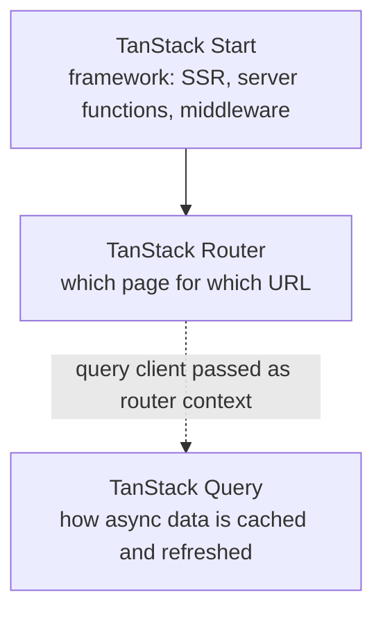

# Terminologies & Glossary

> Definitions of the technical terms, technologies and project-specific names used across the **Andyy DZ Cybersecurity Portfolio** (`andyydz/andyy-s-site`) and its documentation.
> Each entry separates the **general meaning** of a term from **how it appears in this project**.

---

## 1. Purpose of This Glossary

The portfolio looks like a simple website, but it combines many technical areas:

- frontend development with **React** and **TypeScript**
- the **TanStack** ecosystem (Start, Router, Query)
- **routing** and **server-side functionality**
- **Supabase** for **authentication** and **database-backed** features
- **analytics and tracking**
- **SEO** metadata
- **security** headers and request protection
- server configuration and **deployment** on Vercel
- **portfolio content management** through a central data file
- a **responsive UI** with **accessibility** and **reduced-motion** considerations

A shared vocabulary keeps the other documents in `docs/` consistent, so a reader of `03-system-architecture.md` or `13-security.md` can look up a term here instead of researching it elsewhere. It is written for the project developer, college project evaluators, viva and presentation preparation, future contributors, and recruiters reviewing the project.

**How to read the tables:** the *general meaning* is what the term means anywhere in software. The *project context* is what it means in this repository. Where a general concept is **not** implemented here, the entry says so.

---

## 2. General Project Terminology

| Term | Definition | Project Context |
|---|---|---|
| **Portfolio Website** | A website that presents a person's work and skills to an audience such as recruiters. | ANDYY-S-SITE: a cybersecurity / SOC Analyst portfolio deployed at `andyy-s-site.vercel.app`. |
| **Personal Portfolio** | A portfolio owned and maintained by one individual rather than an organization. | The site presents one author, Andrew Vinston D'Souza, known as "Andyy". |
| **Public Site** | The part of a website open to any visitor without signing in. | The route `/` (`src/routes/index.tsx`) and the resources served to visitors (resume, `robots.txt`, sitemap). |
| **Admin Dashboard** | A private page for the site owner to view operational data. | `/admin` (`src/routes/admin.tsx`): shows page-view totals, referrers, link clicks and contact submissions. |
| **Admin Area** | The set of pages and server functions restricted to administrators. | The `/admin` route plus the server functions in `src/lib/admin.functions.ts`. |
| **Contact Submission** | One message sent through a website's contact form. | A row in the `contact_submissions` database table, created by the `submitContact` server function. |
| **Portfolio Content** | The information a portfolio displays: bio, skills, projects and so on. | Held in `src/data/profile.ts`. |
| **Project Data** | The description of individual projects a portfolio showcases. | `profile.featuredProjects` (case studies) and `profile.projects` (cards) in `src/data/profile.ts`. |
| **Profile Data** | The identity-level information about the owner. | The `profile` object: name, alias, title, email, links, biography and the rest of the content. |
| **Social Links** | Links to a person's profiles on other platforms. | `profile.links`: GitHub, LinkedIn, TryHackMe and Reddit, plus the resume path. |
| **Resume** | A document summarizing a person's background, usually a PDF. | `public/resume.pdf`, served at `/resume.pdf` and linked from the header and hero. |
| **Production Environment** | The live environment real users access. | The Vercel deployment at `https://andyy-s-site.vercel.app`. |
| **Development Environment** | The environment a developer uses while building. | Started with `npm run dev` (`vite dev`). |
| **Build** | Turning source code into the files a server can run. | `npm run build` runs `vite build`. |
| **Deployment** | Publishing a build so users can reach it. | Handled by Vercel from the GitHub repository. Vercel settings live outside the repository. |

---

## 3. Frontend Terminology

| Term | General meaning | In this project |
|---|---|---|
| **React** | A JavaScript library for building interfaces from components. | React 19 is the UI library for every visible element. |
| **React component** | A reusable function that returns interface markup. | `Hero`, `About`, `Contact` and others in `src/components/`. |
| **Functional component** | A component written as a function (as opposed to a class). | All portfolio components are function components. |
| **JSX** | Syntax that lets markup be written inside JavaScript. | Used throughout the components. |
| **TSX** | JSX inside a TypeScript file (`.tsx`). | Component and route files, for example `hero.tsx`, `index.tsx`. Non-JSX modules use `.ts`. |
| **React DOM** | The package that renders React components into the browser DOM. | Hydrates the server-rendered HTML in the browser. |
| **Props** | Inputs passed from a parent component to a child. | For example the `Section` wrapper in `sections.tsx` and `MatrixRain` (`opacity`, `speed`). |
| **State** | Data owned by a component that triggers re-rendering when it changes. | Skill-group expansion, mobile menu, form fields, intro visibility. |
| **Hooks** | Functions such as `useState` that let components use React features. | Built-in hooks plus the custom hooks in `src/hooks/`. |
| **Custom hooks** | Project-defined hooks that package reusable logic. | `useGitHubStats`, `useReveal`, `usePrefersReducedMotion`. |
| **Conditional rendering** | Rendering different output depending on a condition. | The intro only renders while `showIntro` is true; the admin page shows a login card or the dashboard; the contact form shows a success line after sending. |
| **Component composition** | Building a page by nesting components. | `routes/index.tsx` composes the section components into the homepage. |
| **Responsive design** | Layouts that adapt to screen size. | Tailwind breakpoint classes, a collapsing header menu, a table that scrolls inside its container. |
| **Client-side interaction** | Behavior that runs in the visitor's browser. | Expanding skill groups, copy-to-clipboard, scroll-aware navigation, GitHub data fetching. |
| **Event handling** | Running code in response to user actions. | `onClick` for tracked links and toggles, `onSubmit` for the contact form. |
| **Form handling** | Collecting and processing form input. | `Contact` in `sections.tsx` reads submitted values and calls a server function. |
| **Form validation** | Checking input against rules before accepting it. | Browser checks in `Contact`, repeated with Zod in `src/lib/tracking.functions.ts`. |
| **UI component** | A general-purpose interface building block. | The primitives in `src/components/ui/`. |
| **Reusable component** | A component designed for use in many places. | `ui/` primitives; `TimelineList` reused for experience and volunteering. |
| **Section component** | A component that renders one named block of the page. | `About`, `Skills`, `Projects`, `Certifications`, `Experience`, `Volunteering`, `Testimonial`, `Contact` in `sections.tsx`. |
| **Layout component** | A component that provides structure and spacing. | The `Section` wrapper (anchor id, scroll offset, reveal animation) and the root shell in `__root.tsx`. |
| **Navigation component** | A component for moving around the site. | `SiteNav` in `site-nav.tsx`. |

---

## 4. React Terminology

| Term | General meaning | In this project |
|---|---|---|
| **React 19** | The current major React version. | Declared in `package.json`. |
| **Component** | A unit of UI logic and markup. | See Section 3. |
| **JSX / TSX** | Markup-in-code syntax; TSX adds TypeScript. | `*.tsx` files. |
| **Hooks** | Functions that attach React features to components. | `useState`, `useEffect`, `useRef` and custom hooks. |
| **`useState`** | Hook that stores a value and re-renders on change. | Form fields, `showIntro` in `routes/index.tsx`, menu and expansion toggles. |
| **`useEffect`** | Hook that runs side effects after rendering. | Page-view tracking, the intro `localStorage` check, GitHub fetching in `use-github-stats.ts`, scroll and observer listeners. |
| **`useRef`** | Hook that holds a mutable reference, often a DOM node. | Element references for observers, for example inside `useReveal`. |
| **Context** | A way to pass values down the tree without props. | TanStack Router context carries the `QueryClient`. No custom context was found in the portfolio's own components. |
| **Provider** | A component that supplies context to its children. | `QueryClientProvider` in `src/routes/__root.tsx`. |
| **`QueryClientProvider`** | TanStack Query's provider that makes a query client available. | Wraps the whole app inside `RootComponent`, so any component can use queries. |
| **React rendering** | Converting components into output. | Done on the server for `/` (SSR) and in the browser for hydration and for `/admin`. |
| **Conditional rendering** | Output that depends on state. | See Section 3. |
| **Event handlers** | Functions responding to events. | `onClick`, `onSubmit`, `onChange`. |
| **Component lifecycle concepts** | Mounting, updating and unmounting. | Expressed with `useEffect` and its cleanup, for example removing listeners and cancelling a stale GitHub fetch. |
| **Client-side state** | State held in the browser. | All `useState` values. |
| **Local state** | State belonging to one component. | Skill-group expansion inside `Skills`. |
| **Persistent browser state** | State kept between visits. | The intro flag in `localStorage` (see Section 20). |

**How the app is composed.** `__root.tsx` provides the shell and the `QueryClientProvider`, then renders the matched route through `<Outlet />`. For `/`, `routes/index.tsx` composes `IntroSequence`, `SiteNav`, `Hero` and the section components into one page.

---

## 5. TypeScript Terminology

| Term | General meaning | In this project |
|---|---|---|
| **TypeScript** | JavaScript with a static type system. | The language of all source files (`.ts`, `.tsx`). |
| **Type safety** | Catching type mistakes before code runs. | Enabled by strict compiler settings. |
| **Static typing** | Types checked at development or build time, not at runtime. | Applies to every module. |
| **Type inference** | The compiler deducing types without annotations. | `export type Profile = typeof profile` in `profile.ts` derives the type from the data. |
| **Interface** | A named object shape that can also extend existing shapes. | `lovable-error-reporting.ts` uses an `interface Window` declaration to add optional editor hooks to the browser `Window` type. |
| **Type alias** | A name for any type. | `GitHubStats` in `use-github-stats.ts`, `AdminOverview` in `admin.functions.ts`, `Props` in `matrix-rain.tsx`. |
| **Generic** | A type parameterized by another type. | `useReveal<T extends HTMLElement = HTMLElement>()` in `use-reveal.ts`. |
| **Union type** | A value that can be one of several types. | Appears implicitly wherever a value may be absent, such as data that has not loaded yet. |
| **Optional property** | A property that may be missing. | For example `repo?` in the GitHub event type. `exactOptionalPropertyTypes` is enabled. |
| **Strict mode** | A group of strict compiler checks. | `strict: true` in `tsconfig.json`. |
| **`tsconfig.json`** | The TypeScript configuration file. | Sets the options below. |
| **Type checking** | Verifying types across the code. | Compiler checking only. There is no dedicated `tsc` script in `package.json`. |
| **TSX** | TypeScript plus JSX. | See Section 3. |

### 5.1 Configuration in `tsconfig.json`

| Setting | Value | Meaning |
|---|---|---|
| `target` | `ES2022` | Compile to the ES2022 language level |
| `jsx` | `react-jsx` | React's modern JSX transform |
| `module` | `ESNext` | Use modern ES modules |
| `moduleResolution` | `Bundler` | Resolve imports the way a bundler such as Vite does |
| `strict` | `true` | Enable the strict check family |
| `noEmit` | `true` | Do not write compiled output. Vite produces the build. |
| `paths` | `@/*` → `./src/*` | Path alias, so imports read `@/data/profile` |

Additional strict options are set: `noUncheckedIndexedAccess`, `exactOptionalPropertyTypes`, `noImplicitReturns` and `noUncheckedSideEffectImports`.

---

## 6. TanStack Terminology

| Term | General meaning | In this project |
|---|---|---|
| **TanStack Start** | A full-stack React framework: SSR, server functions, middleware. | The application framework: `src/server.ts`, `src/start.ts`, server functions. |
| **TanStack Router** | A type-safe router for React. | File-based routing in `src/routes/`, configured in `src/router.tsx`. |
| **TanStack Query** | A library for fetching, caching and managing asynchronous data. | Provided app-wide. Used by `useQuery` in `src/routes/admin.tsx`. |
| **Route** | A URL pattern mapped to a page or handler. | `/`, `/admin`, `/sitemap.xml`. |
| **Route tree** | The full hierarchy of routes. | Generated into `src/routeTree.gen.ts`. |
| **Root route** | The top-level route wrapping every other route. | `src/routes/__root.tsx`. |
| **Nested route** | A route rendered inside another route. | Every route renders inside the root through `<Outlet />`. |
| **Route metadata** | Per-route head information (title, meta tags, links, scripts). | The `head` definitions in `__root.tsx`, `index.tsx` and `admin.tsx`. |
| **`routeTree.gen.ts`** | A generated file describing the routes. | Not edited by hand. Excluded from formatting by `.prettierignore`. |
| **Router** | The object that matches URLs and renders routes. | Created by `getRouter()` in `src/router.tsx`. |
| **Query client** | The TanStack Query object that holds the cache. | Created in `getRouter()` and passed as router context. |
| **Server-side functionality** | Code that runs on the server instead of the browser. | Server functions, middleware, the sitemap handler, the custom server entry. |
| **Server function** | A function callable from the browser whose body executes on the server. | `createServerFn` functions in `src/lib/*.functions.ts`. |

### 6.1 Router vs Query vs Start

| Technology | Question it answers | Example here |
|---|---|---|
| **TanStack Router** | "Which component renders for this URL?" | `/admin` renders `admin.tsx` |
| **TanStack Query** | "How is asynchronous data loaded, cached and re-fetched?" | `useQuery` loading the admin overview |
| **TanStack Start** | "How does the whole application run on a server and in the browser?" | SSR, `submitContact`, middleware in `start.ts` |

They are separate libraries that cooperate. Start builds on Router, and Query is independent of both. In this project the query client is created alongside the router and shared through router context.

---

## 7. Routing Terminology

| Term | General meaning | In this project |
|---|---|---|
| **Routing** | Mapping URLs to what is shown. | File-based: each file in `src/routes/` defines a route. |
| **Route** | One URL pattern and its handler. | Three routes exist. |
| **Root route** | Wrapper for all routes. | `__root.tsx`: HTML shell, providers, 404 and error components. |
| **Index route** | The route for the base path `/`. | `index.tsx`: the public portfolio. |
| **Admin route** | A route for administration. | `admin.tsx`: the private dashboard. |
| **Sitemap route** | A route that generates a sitemap. | `sitemap[.]xml.ts` serves `/sitemap.xml`. |
| **Route metadata** | Head data for a route. | Title, meta tags, canonical link and JSON-LD on `/`. `noindex, nofollow` on `/admin`. |
| **Dynamic route** | A route with URL parameters, such as `/posts/:id`. | **Not present.** All three routes are static. |
| **Route tree** | Generated hierarchy of routes. | `src/routeTree.gen.ts`. |
| **Client navigation** | Moving between pages without a full reload. | TanStack `Link` is used on the 404 page. The main navigation uses in-page anchors (`#about`, `#skills`, …). |
| **Server routing** | Routes answered by server code. | `/sitemap.xml` returns XML from a server handler. |
| **404 / Not Found handling** | The response for unknown URLs. | `notFoundComponent` in `__root.tsx`: a terminal-styled "SEGMENT NOT FOUND" page. |
| **Error handling** | Handling failures while rendering. | `errorComponent` in `__root.tsx` ("This page didn't load"). |

| Route file | Purpose |
|---|---|
| `src/routes/__root.tsx` | Global shell: HTML document, head defaults, fonts, `QueryClientProvider`, `<Outlet />`, 404 and error screens |
| `src/routes/index.tsx` | The public portfolio homepage, with SEO metadata and structured data |
| `src/routes/admin.tsx` | Private dashboard, client-rendered, `noindex, nofollow` |
| `src/routes/sitemap[.]xml.ts` | XML sitemap endpoint |

---

## 8. Server-Side Terminology

| Term | General meaning | In this project |
|---|---|---|
| **Server** | The computer or process answering requests. | The TanStack Start server hosted on Vercel. |
| **Server entry** | The module that receives incoming requests. | `src/server.ts`, which wraps TanStack Start's default entry. |
| **Server function** | Browser-callable function that runs server-side. | `logPageView`, `logLinkClick`, `submitContact`, `claimAdmin`, `isAdmin`, `getAdminOverview`. |
| **Server middleware** | Code that runs around requests before or after the handler. | `errorMiddleware`, `csrfMiddleware`, `requireSupabaseAuth`. |
| **Server request** | The incoming HTTP request. | Page loads and server-function calls. |
| **Server response** | The reply sent back. | HTML pages, JSON results, XML sitemap, error pages. |
| **SSR / Server-side rendering** | Producing HTML on the server. | Used for `/`. |
| **CSR / Client-side rendering** | Producing HTML in the browser. | Used for `/admin` (`ssr: false`) and for the GitHub data on `/`. |
| **Error middleware** | Middleware that catches unhandled errors. | `errorMiddleware` in `src/start.ts` returns the static error page. |
| **Security headers** | Response headers that instruct the browser to enforce protections. | Added in `src/server.ts` (see Section 14). |
| **Backend origin** | The URL origin of a backend service. | The Supabase origin, read from environment variables and allowed in the Content Security Policy. |
| **Environment variables** | Configuration supplied outside the code. | See Section 22. |

**Roles of the two key files**

| File | Role |
|---|---|
| `src/server.ts` | Custom server entry: loads the TanStack Start entry, normalizes catastrophic SSR errors into a proper error page, and adds security headers to every response |
| `src/start.ts` | Registers middleware: Supabase token attachment, error middleware, CSRF middleware |

**Where code runs**

| Layer | Examples |
|---|---|
| **Application server** | SSR, server functions, `server.ts`, sitemap handler |
| **Browser** | Components, GitHub `fetch`, form validation, Supabase sign-in on `/admin` |
| **Supabase backend services** | Auth and Postgres, reached by server functions (and, for sign-in, the browser) |

---

## 9. Supabase Terminology

| Term | General meaning | In this project |
|---|---|---|
| **Supabase** | A hosted backend platform built on Postgres, with authentication. | Provides the database and admin authentication. |
| **Supabase client** | The JavaScript object used to talk to Supabase. | `client.ts` (browser, publishable key) and `client.server.ts` (server, service-role key). |
| **Supabase URL** | The address of a Supabase project. | Read from `SUPABASE_URL` / `VITE_SUPABASE_URL`. |
| **Supabase authentication** | Supabase's sign
