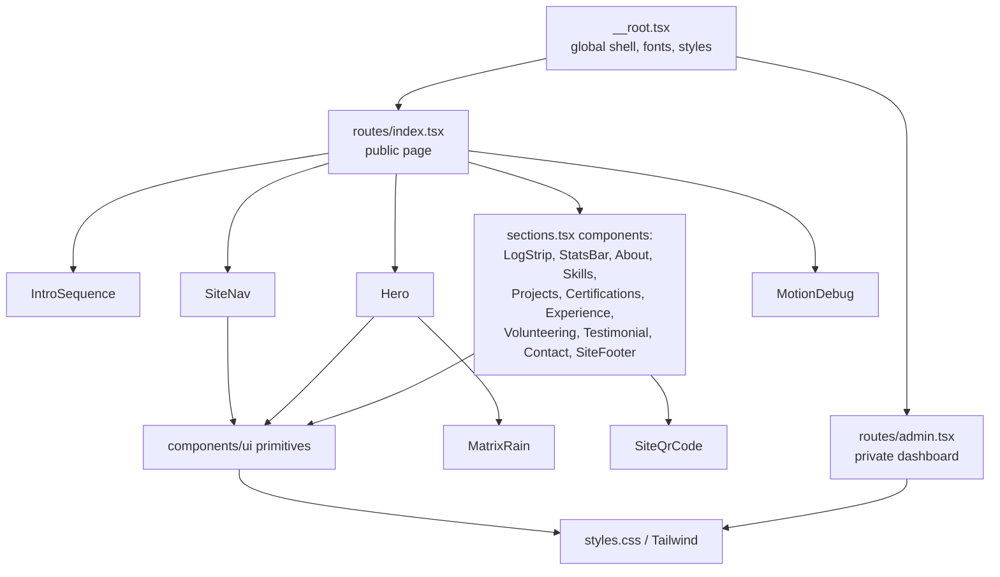

# UI Design & User Experience Documentation

> How the interface of **ANDYY-S-SITE** is structured, styled, and interacted with, grounded in `src/routes/`, `src/components/`, `src/components/ui/`, `src/data/profile.ts`, and `src/styles.css`.

---

## 1. UI Design Overview

**Overall UI concept.** The interface presents a **retro CRT / terminal-inspired cybersecurity aesthetic**: a dark, monospace-accented, shell-like presentation that signals the author's technical identity to a recruiter audience while remaining easy to scan.

**Purpose of the design.** To make a SOC-Analyst-track portfolio feel authentically technical (section headers written as shell commands, terminal panels, a boot-style intro) without sacrificing the professional usability a recruiter needs: fast access to skills, projects, certifications, and the resume.

**Main user experience.** The site is a **single scrolling page** (`/`) with anchor-based section navigation. There is no multi-page browsing experience for the public portfolio.

**Public portfolio interface.** Hero → activity log → statistics → About → Skills → Projects → Certifications → Experience → Volunteering → Testimonial → Contact → Footer, composed in `src/routes/index.tsx`.

**Administrative interface.** A separate, client-rendered `/admin` page (`src/routes/admin.tsx`) with a login card and, once authenticated, a dashboard of analytics and contact submissions. It is visually simpler than the public site and is not part of the public navigation.

**Responsive behavior.** The layout adapts across desktop, tablet, and mobile widths using Tailwind CSS breakpoint utilities; the header collapses into a mobile menu below the medium breakpoint.

**Interactive elements.** Expandable skill groups, a copy-to-clipboard email control, a contact form with live validation feedback, a skippable intro sequence, and scroll-aware active-section highlighting in the header.

**Animation/motion.** Reveal-on-scroll for sections, count-up animation for statistics, a one-time terminal boot intro, and a decorative matrix-rain canvas in the hero — all disabled when the visitor's browser signals `prefers-reduced-motion`.

**Accessibility considerations.** Semantic landmarks, labelled form fields, `aria-live` regions for form errors and status, `aria-expanded` on togglable controls, visible focus outlines, and full reduced-motion support (see Section 9).

**Navigation structure.** A fixed header with in-page anchor links (`#about`, `#skills`, `#projects`, `#certifications`, `#experience`, `#contact`); Volunteering and Testimonial exist as sections but are not in the header.

---

## 2. UI Architecture

```text
Route (src/routes/index.tsx, src/routes/admin.tsx)
  ↓
Page-level composition (assembles section components)
  ↓
Reusable section components (src/components/: hero.tsx, sections.tsx, site-nav.tsx, intro-sequence.tsx, matrix-rain.tsx, qr-code.tsx, motion-debug.tsx)
  ↓
UI primitives (src/components/ui/: generated shadcn/ui components on Radix UI)
  ↓
CSS / Tailwind styling (src/styles.css: tokens, effects, responsive and print rules)
  ↓
Browser (rendered, server-side first, then hydrated)
```

| Layer | Location | Role |
|---|---|---|
| **Routes** | `src/routes/` | Decide which page renders and its metadata; compose components |
| **Section components** | `src/components/` | Portfolio-specific blocks (Hero, About, Skills, Projects, etc.) that read from `profile` data |
| **UI primitives** | `src/components/ui/` | Generic, content-free building blocks (only `Button` is confirmed in use on the public page) |
| **Data** | `src/data/profile.ts` | Supplies all portfolio text and links consumed by section components — content is not hard-coded into the UI |
| **Styling** | `src/styles.css` | Global tokens, Tailwind base, terminal-effect utilities, reduced-motion and print rules |

Section components never define their own content; they render whatever `profile` provides, so the same component structure works no matter what the underlying data says.

---

## 3. Page Hierarchy and Homepage Layout

`src/routes/index.tsx` renders, in order:

| # | Component | Purpose |
|---|---|---|
| 1 | `IntroSequence` | First-visit boot animation (conditionally rendered) |
| 2 | `SiteNav` | Fixed header |
| 3 | `Hero` | Name, role, actions, headshot, matrix background |
| 4 | `LogStrip` | Terminal-style activity log |
| 5 | `StatsBar` | TryHackMe figures, GitHub summary, notable rooms |
| 6 | `About` | Biography |
| 7 | `Skills` | Expandable skill groups |
| 8 | `Projects` | Featured case studies + project cards |
| 9 | `Certifications` | Certification table |
| 10 | `Experience` | Experience timeline |
| 11 | `Volunteering` | Volunteering timeline |
| 12 | `Testimonial` | Written recommendation |
| 13 | `Contact` | Links + contact form |
| 14 | `SiteFooter` | Footer links + QR code |
| 15 | `MotionDebug` | Hidden dev/QA overlay |

A decorative `scanlines` overlay renders above everything else, and each section is wrapped by a shared `Section` layout component providing a consistent anchor ID, scroll offset (`scroll-mt-20`), and reveal-on-scroll behavior.

---

## 4. Navigation (`site-nav.tsx`)

- **Desktop:** inline anchor links to About, Skills, Projects, Certifications, Experience, Contact.
- **Mobile:** links collapse into a menu opened by a labelled toggle button; the menu closes automatically once a link is chosen.
- **Active section:** an `IntersectionObserver` tracks which section is in view and marks the corresponding link with `aria-current="location"`.
- **Scroll-aware background:** the header gains a background/border once the page has scrolled past the top.
- **Resume access:** a direct resume link is present in both the desktop and mobile navigation.
- External links (GitHub, LinkedIn, TryHackMe, Reddit, project repos) open in a new tab with `noopener` protection.

---

## 5. Hero (`hero.tsx`)

Displays name, alias, title, a short supporting line, a profile photo, and primary actions (resume, contact, GitHub, LinkedIn). Hosts the `MatrixRain` canvas effect as a background layer.

---

## 6. Section Design Patterns (`sections.tsx`)

| Component | Interaction pattern |
|---|---|
| `LogStrip` | Shows a short set of activity lines by default; an expand control reveals the rest |
| `StatsBar` | Statistic values animate upward (count-up) when scrolled into view |
| `Skills` | Each skill group can be expanded/collapsed individually, with a single control to expand or collapse all groups at once; each group shows its item count |
| `Projects` | Featured projects render as case-study cards (problem/approach/outcome/next); additional projects render as smaller tagged cards |
| `Certifications` | Rendered as a table, with an in-progress line beneath it; the table scrolls within its own container on narrow screens rather than causing the page to scroll horizontally |
| `Experience` / `Volunteering` | Share a `TimelineList` pattern: role, organization, period, and summary points |
| `Testimonial` | A `blockquote` with attribution |
| `Contact` | Link list plus a form (see Section 7) |
| `SiteFooter` | Repeats professional links and renders `SiteQrCode` |

---

## 7. Forms (Contact)

The contact form (inside `Contact` in `sections.tsx`) has three visible fields — name, email, message — plus a hidden honeypot (`company_url`, not focusable, hidden from assistive technology). Validation errors render in an `aria-live` list next to the fields. On submit, the form shows a success line or an inline error message rather than navigating away. Labels are associated with their inputs via `htmlFor`.

---

## 8. Admin Interface (`admin.tsx`)

A simpler, utilitarian interface distinct from the public site's terminal aesthetic:

- A login card (email/password sign-in, plus an "create owner account" mode).
- Once authenticated, a dashboard of numeric totals, a referrers list, a most-clicked-links list, and a table of recent contact submissions.
- The page is client-rendered only (`ssr: false`) and excluded from search indexing.

---

## 9. Responsive Behavior

- Multi-column layouts (hero actions, statistics cards, project cards, the contact section) collapse to fewer columns at narrower Tailwind breakpoints.
- The header navigation switches from inline links to a collapsible mobile menu below the medium breakpoint.
- The certifications table scrolls horizontally within its own bounded container rather than widening the page.
- Interactive controls in the navigation and hero maintain touch targets of at least 44px.

No formal cross-device testing matrix is documented in the repository; responsive behavior is implemented through Tailwind's utility breakpoints rather than a separate design-system specification.

---

## 10. Typography

| Typeface | Used for | Source |
|---|---|---|
| **JetBrains Mono** | Headings, interface labels, terminal-style text | Google Fonts, with a system monospace fallback |
| **Inter** | Body text | Google Fonts, with a system sans-serif fallback |

Both are loaded via a Google Fonts stylesheet link with `display=swap` in `src/routes/__root.tsx`, so text remains visible while fonts load.

---

## 11. Color / Theme

Colors are defined as CSS custom properties (design tokens) in `src/styles.css` using `oklch()` values: a near-black background with a phosphor-green primary accent and an amber secondary accent, consistent with the CRT/terminal concept. There is a single dark theme; no light-mode toggle exists in the source.

---

## 12. Spacing / Layout System

Layout and spacing are handled entirely through **Tailwind CSS v4 utility classes** applied directly in component markup (`gap-*`, `p-*`, `grid`, `flex`, responsive prefixes such as `md:`). There is no separate spacing-scale specification beyond Tailwind's own defaults; the project does not define a custom design-system document.

---

## 13. Icons

**Lucide React** supplies the icon set used across the hero, navigation, and section components (for example, external-link and social icons).

---

## 14. Animation and Transitions

| Effect | Where | Behavior |
|---|---|---|
| Reveal-on-scroll | Every `Section` | Fades/slides content in as it enters the viewport, via the `useReveal` hook |
| Count-up numbers | `StatsBar` | Animates statistic values upward once, on first scroll into view |
| Intro sequence | `IntroSequence` | One-time terminal boot animation, skippable via Escape or pointer, gated by a `localStorage` flag |
| Matrix rain | `MatrixRain` (in `Hero`) | Decorative canvas animation |
| Motion budget | Project-wide | Interface animations are targeted to a 400ms duration budget; ambient effects (blinking caret, pulses, shimmer) are exempt. A hidden dev/QA overlay (`MotionDebug`, opened with `Ctrl+Shift+D` or `?debug=motion`) audits this budget. |

---

## 15. Reduced-Motion Behavior

The `usePrefersReducedMotion` hook (in `src/hooks/use-reveal.ts`) detects the OS-level `prefers-reduced-motion` setting. When active:

- `MatrixRain` does not render.
- `IntroSequence` completes immediately instead of animating.
- Statistic counters display their final values immediately rather than counting up.
- A CSS `prefers-reduced-motion` block in `styles.css` disables transitions and smooth scrolling for everything else.

---

## 16. Accessibility Considerations

- **Semantic structure:** `header`, a labelled `nav`, `main`, `section`, `article` (for projects), a `table` with column headers, and `blockquote`.
- **Alt text:** the profile photo and the QR code have descriptive alt text; purely decorative elements (scanlines, matrix rain, icons) are hidden from assistive technology with `aria-hidden`.
- **Form accessibility:** labelled fields, `aria-live` regions for validation errors and submission/copy status.
- **Expandable controls:** `aria-expanded` on the skill-group and log-strip toggles.
- **Keyboard access:** all interactive elements are native buttons/links with visible `focus-visible` outlines; the intro can be skipped with Escape.
- **Print:** a dedicated print stylesheet strips the terminal styling in favor of a plain, light, readable layout and hides the contact form.

No formal WCAG conformance level has been evaluated or is claimed; the above describes what is implemented, not a certified audit result.

---

## 17. Component Relationship Diagram



---

## 18. Summary

The interface favors a **consistent, low-noise terminal aesthetic** applied uniformly through a small set of reused patterns — one dark theme, one monospace/sans-serif typeface pairing, bordered panels, and a shared `Section` reveal wrapper — rather than a large, varied design system. UI primitives (`components/ui/`) are kept separate from portfolio-specific sections (`components/`), and all portfolio content flows in from `src/data/profile.ts` rather than being hard-coded into the components. Motion, from the boot intro to statistic count-ups, is implemented consistently with a reduced-motion fallback, and the admin interface is deliberately simpler and visually distinct from the public-facing terminal design.
