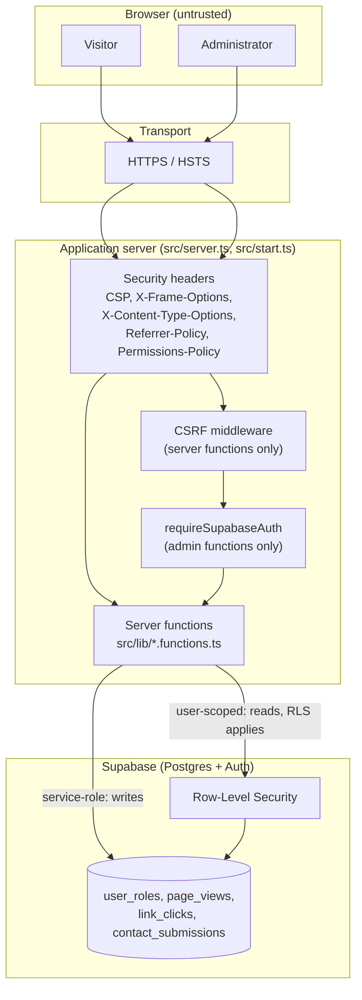
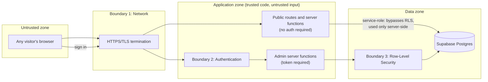

# Security

> The security posture of **ANDYY-S-SITE** (`andyydz/andyy-s-site`), grounded in `src/server.ts`, `src/start.ts`, `src/routes/admin.tsx`, `src/routes/__root.tsx`, `src/integrations/supabase/`, `supabase/migrations/`, `src/lib/`, `src/components/sections.tsx`, and `src/hooks/use-github-stats.ts`.
> This document describes implemented controls. It is not a certified audit, a penetration test, or a claim of complete security. No security score or rating is assigned.

---

## 1. Security Architecture Overview

Security is layered across the browser, the server, and the database, rather than relying on any single control.

---

## 2. Threat Model

| Threat | Relevant asset | Mitigation | Residual risk |
|---|---|---|---|
| Spam / automated contact-form abuse | Contact form, `contact_submissions` | Honeypot field (`company_url`) + rate limiting (3/hour per visitor hash) | A determined attacker rotating IPs and user agents could still submit slowly |
| Cross-site request forgery against server functions | All server functions | `csrfMiddleware` in `src/start.ts`, scoped to server functions | Not applicable to non-function routes, but those routes perform no state changes |
| Unauthorized access to analytics / contact data | `page_views`, `link_clicks`, `contact_submissions` | Authentication + role check + RLS (three independent layers) | A compromised admin credential would still bypass all three |
| Unauthorized admin role grant | `user_roles` | `claimAdmin` only grants the role once, and only to the email hard-coded in `profile.ts` | If that email account itself is compromised, admin access follows |
| Clickjacking | The public and admin pages | `X-Frame-Options: DENY` | None identified |
| MIME-type confusion attacks | Static and served assets | `X-Content-Type-Options: nosniff` | None identified |
| Script/style injection (XSS) | Any user-controlled or third-party content rendered in the page | Content Security Policy; React escapes rendered text by default | CSP permits `'unsafe-inline'` for scripts and styles, which weakens this specific defense |
| Referrer / URL information leakage | Any outbound navigation | `Referrer-Policy: strict-origin-when-cross-origin` | None identified |
| Unwanted browser feature access | Camera, microphone, geolocation | `Permissions-Policy` disables all three | None identified |
| Man-in-the-middle interception | All traffic | HTTPS (Vercel) + HSTS | Relies on the hosting platform's HTTPS enforcement |
| Credential/secret leakage | Supabase service-role key | Server-only environment variable, loaded via dynamic `import()` only inside handlers, `.env` git-ignored | Depends on correct configuration in the Vercel dashboard, which is outside the repository |
| Excessive/automated page-view logging | `page_views` table, analytics accuracy | Rate limiting (30/hour per visitor hash) | Distributed abuse across many hashes is not specifically mitigated |
| Search-engine exposure of the admin page | `/admin` | `noindex, nofollow` meta + `Disallow: /admin` in `robots.txt` | Neither mechanism is access control; the page is still publicly reachable by URL |
| External API compromise or unavailability (GitHub, contributions API) | Live statistics display | Fallback to static content on failure; no authentication tokens exposed | The app has no control over these third-party services' own security |

---

## 3. Security Control Table

| Control | Type | Location | Confirmed by |
|---|---|---|---|
| Content-Security-Policy | HTTP response header | `src/server.ts` | Source inspection |
| Strict-Transport-Security (HSTS) | HTTP response header | `src/server.ts` | Source inspection |
| X-Frame-Options: DENY | HTTP response header | `src/server.ts` | Source inspection |
| X-Content-Type-Options: nosniff | HTTP response header | `src/server.ts` | Source inspection |
| Referrer-Policy | HTTP response header + meta tag | `src/server.ts`, `src/routes/__root.tsx` | Source inspection |
| Permissions-Policy | HTTP response header | `src/server.ts` | Source inspection |
| CSRF middleware | Request middleware | `src/start.ts`, scoped to `handlerType === "serverFn"` | Source inspection |
| Server-side input validation | Zod schemas | `src/lib/tracking.functions.ts` | Source inspection |
| Client-side input validation | Form checks | `src/components/sections.tsx` (`Contact`) | Source inspection |
| Honeypot field | Anti-spam | `company_url` field, `src/components/sections.tsx` / `src/lib/tracking.functions.ts` | Source inspection |
| Contact rate limiting | Abuse prevention | 3 submissions/hour per sender hash, `submitContact` | Source inspection |
| Page-view rate limiting | Abuse prevention | 30 views/hour per visitor hash, `logPageView` | Source inspection |
| Visitor/sender hashing | Privacy-preserving identification | SHA-256 of IP + user agent + date, `src/lib/tracking.functions.ts` | Source inspection |
| No raw IP storage | Data minimization | Confirmed: hash only, not the address itself | Source inspection |
| Token-based authentication | Admin access | Supabase Auth (`supabase.auth`), verified server-side with `getClaims` in `auth-middleware.ts` | Source inspection |
| Role-based authorization | Admin access | `admin` role in `user_roles`, checked in `getAdminOverview` | Source inspection, `supabase/migrations/` |
| Row-Level Security (RLS) | Database access control | Enabled on all 4 tables | `supabase/migrations/` |
| Service-role key confinement | Secret handling | Loaded only inside server function handlers via dynamic `import()` | Source inspection |
| `.env` exclusion | Secret handling | Git-ignored | `.gitignore` |
| `security.txt` | Vulnerability disclosure | `public/security.txt`, `public/.well-known/security.txt` | Source inspection |
| Admin `noindex`/`nofollow` | Search exposure reduction | `src/routes/admin.tsx` metadata + `robots.txt` | Source inspection |

---

## 4. Security Boundary Diagram

**Boundary 1 (network):** everything outside HTTPS is untrusted.
**Boundary 2 (authentication):** separates anonymous visitors from the authenticated administrator; enforced by Supabase Auth token verification.
**Boundary 3 (authorization/RLS):** even an authenticated non-admin user (a hypothetical scenario, since only one role exists today) would be blocked from reading analytics or contact data by RLS policies, independent of the application-level role check.

---

## 5. Authentication and Authorization

| Aspect | Detail |
|---|---|
| Mechanism | Supabase Auth, email/password |
| Used for | The admin account only; public visitors have no accounts |
| Session | Managed by `supabase-js` in the browser; verified per-request server-side via `getClaims` |
| Authorization model | Single `admin` role; `claimAdmin` grants it once, only to the email configured in `profile.ts`, only if no admin exists yet |
| Defense in depth | Token validity → role check in code → RLS at the database — three independent layers protect the same data |

**Authentication vs. authorization**, as distinct concerns here: authentication answers "is this a valid, signed-in user?" (the token check); authorization answers "is this specific user allowed to see this data?" (the role check and RLS).

---

## 6. Input Validation, Honeypot, and Rate Limiting

| Mechanism | Detail |
|---|---|
| Client validation | Name 2–80 chars, email format + ≤254 chars, message 10–1000 chars |
| Server validation | The same rules re-enforced with Zod in `submitContact`, since client checks can be bypassed |
| Honeypot | Hidden `company_url` field; a filled value causes silent acceptance with no storage, giving automated tools no feedback |
| Contact rate limit | 3 submissions per hour, keyed by sender hash |
| Page-view rate limit | 30 views per hour, keyed by visitor hash |
| Visitor/sender hash | SHA-256 over IP address, user agent, and the current date |

**This hashing is not full anonymization.** It reduces what is stored (no raw IP) and lets repeated activity from the same source be recognized without keeping a directly identifying value, but a hash of IP + user agent + date is a form of pseudonymization, not anonymity: given the same three inputs, the same hash is reproducible, and combined with other data it could still narrow down a source.

---

## 7. Database Security

- **RLS is enabled on all four tables**: `user_roles`, `page_views`, `link_clicks`, `contact_submissions`.
- No browser-facing role has `INSERT` permission on any table; every write goes through a server function using the service-role client.
- `SELECT` on analytics and contact tables is restricted to admins via a `private.has_role` function; `user_roles` lets a user read only their own row.
- Migration history shows **progressive hardening**: (1) initial schema, tables and policies; (2) revoking public execute permission on the role-check function; (3) moving that function into a `private` schema so it can't be called directly by ordinary roles.

---

## 8. External API Security

| API | Authentication | Data exposed | Risk |
|---|---|---|---|
| GitHub public REST API | None | Public repo count, public events | Low — only public data is requested, no token is used or exposed |
| GitHub contributions API (third-party) | None | Aggregated contribution counts | Low, but the app depends on a third party's own security and availability |

Neither integration sends credentials, and both are allow-listed explicitly in the CSP `connect-src` directive rather than left open to arbitrary hosts.

---

## 9. Error Handling and Information Disclosure

- SSR errors are normalized in `src/server.ts` into a static, generic HTML error page (`src/lib/error-page.ts`) rather than leaking stack traces or internal error details to the client.
- `errorMiddleware` in `src/start.ts` catches unhandled errors server-side before they can produce an unstructured response.
- The 404 and rendering-error screens in `src/routes/__root.tsx` are similarly generic.

---

## 10. Public Asset Security

| Asset | Consideration |
|---|---|
| `public/resume.pdf` | Deliberately public; contains only information the author chose to publish |
| `public/og-image.jpg`, `favicon.png` | No sensitivity |
| `public/security.txt`, `.well-known/security.txt` | Intended to be public; provides a disclosure contact |
| `public/robots.txt` | Public by nature; **not an access-control mechanism** — see Section 11 |

---

## 11. Important Clarifications

- **`robots.txt` is not access control.** `Disallow: /admin` asks well-behaved crawlers not to fetch the page; it does not prevent a browser, script, or non-compliant crawler from requesting it directly.
- **`noindex` is not authentication.** It tells search engines not to list a page they do reach; it has no effect on who can open the URL.
- Real protection for `/admin` comes from the authentication and authorization layers in Sections 5–7, not from either of the above.

---

## 12. Security Testing Recommendations

No dedicated security testing (dependency scanning, static analysis, or penetration testing) is currently part of the project's workflow. Recommended, not implemented:

| Recommendation | Purpose |
|---|---|
| Run `npm audit` (or equivalent) periodically | Catch known vulnerabilities in dependencies |
| Add automated tests for `submitContact`'s validation, honeypot, and rate-limit logic | Prevent silent regressions in the contact-form's abuse defenses |
| Periodically re-verify RLS policies after schema changes | Ensure a migration doesn't accidentally widen access |
| Manually attempt unauthorized `/admin` access (no session, wrong role) | Confirm the layered defenses still behave as expected |
| Review the CSP's `'unsafe-inline'` usage | Assess whether a nonce- or hash-based policy is feasible |

---

## 13. Security Limitations

Stated plainly:

- CSP allows inline scripts and styles, weakening its protection against injected content.
- No automated security testing, dependency scanning, or penetration testing has been performed.
- No network/CDN-level rate limiting exists; all throttling is application-level and keyed to a rotating hash rather than a hard IP block.
- The `/admin` sign-up flow is reachable by anyone, though `claimAdmin` restricts the actual role grant to a single, pre-configured email.
- No automated regression tests protect validation, rate-limiting, or RLS behavior against future changes (see `12-testing.md`).
- Visitor/sender hashing is pseudonymization, not full anonymity.
- No formal compliance (OWASP ASVS, SOC 2, GDPR, WCAG, or any other standard) has been evaluated or is claimed.

---

## 14. Summary

Security here is layered rather than singular: transport-level HTTPS/HSTS, a restrictive-but-imperfect CSP alongside four companion headers, CSRF protection scoped to server functions, token-based authentication with a narrowly scoped authorization claim, and row-level security enforced independently at the database. Public-facing abuse is mitigated with a honeypot and hashed, application-level rate limiting rather than a heavier mechanism like CAPTCHA. This document describes what exists; it does not assign a security score, claim formal compliance, or assert that the application is completely secure.
